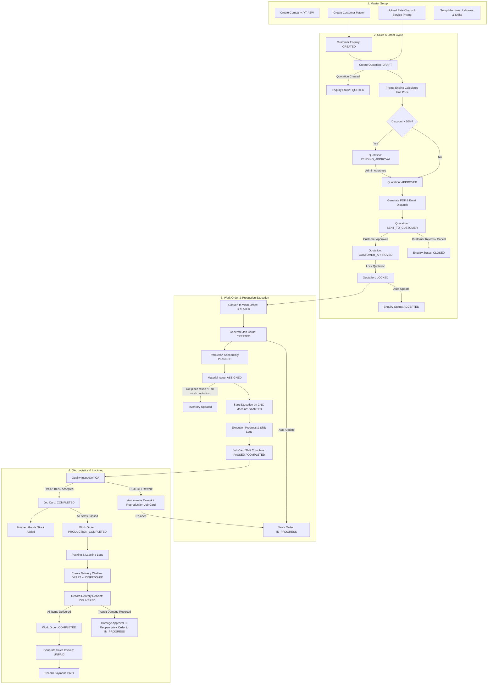
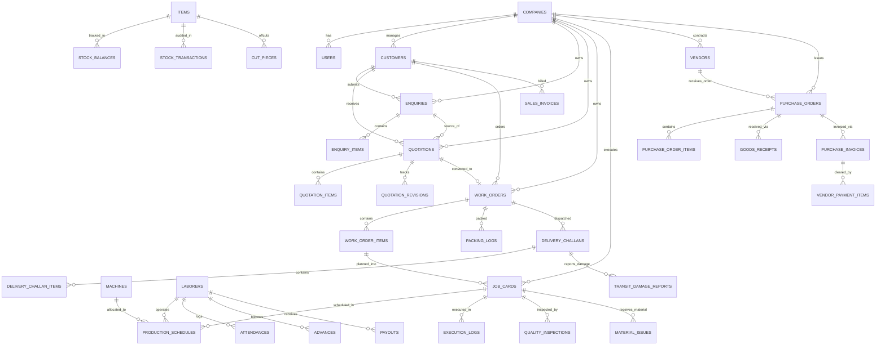

# YashTools ERP — Enterprise Manufacturing & Production Backend

[](https://openjdk.org/projects/jdk/21/)
[](https://spring.io/projects/spring-boot)
[](https://www.postgresql.org/)
[](https://flywaydb.org/)
[]()

Production-grade Spring Boot backend for **YashTools ERP** — an enterprise manufacturing, inventory, procurement, quality control, logistics, and labor management system specifically engineered for cutting tools manufacturing (solid carbide endmills, drills, reamers, custom profile tools, re-sharpening, re-forming, and PVD coatings).

---

## Table of Contents

1. [System Architecture & Tech Stack](#1-system-architecture--tech-stack)
2. [Multi-Company Multi-Tenant Architecture](#2-multi-company-multi-tenant-architecture)
3. [End-to-End Business Flow & Lifecycle](#3-end-to-end-business-flow--lifecycle)
4. [Pricing Engine & Mathematical Models](#4-pricing-engine--mathematical-models)
5. [Database Architecture & Entity Relationship Diagram (ERD)](#5-database-architecture--entity-relationship-diagram-erd)
6. [Complete REST API Catalog](#6-complete-rest-api-catalog)
   - [Authentication & User Management](#auth--user-management)
   - [Company Master](#company-master)
   - [Customer Master](#customer-master)
   - [Enquiry Management](#enquiry-management)
   - [Quotation & Pricing Engine](#quotation--pricing-engine)
   - [Work Order Lifecycle](#work-order-lifecycle)
   - [Production Planning & Scheduling](#production-planning--scheduling)
   - [Shop-Floor Job Cards & Execution](#shop-floor-job-cards--execution)
   - [Quality Inspection & Control (QA)](#quality-inspection--control-qa)
   - [Finished Goods & Packaging](#finished-goods--packaging)
   - [Logistics & Delivery Challans](#logistics--delivery-challans)
   - [Transit Damage Management](#transit-damage-management)
   - [Sales Invoicing & Receivables](#sales-invoicing--receivables)
   - [Procurement & Purchase Orders (P2P)](#procurement--purchase-orders-p2p)
   - [Goods Receipt Notes (GRN) & Inward](#goods-receipt-notes-grn--inward)
   - [Purchase Invoices & Vendor Payments](#purchase-invoices--vendor-payments)
   - [Inventory, Stocks & Cut-Piece Optimization](#inventory-stocks--cut-piece-optimization)
   - [Labor Management, Shifts & Attendance](#labor-management-shifts--attendance)
   - [Master Data & Rate Charts](#master-data--rate-charts)
   - [Unified Reports & Analytics](#unified-reports--analytics)
   - [Audit Logs & Dashboard](#audit-logs--dashboard)
7. [Default Admin Credentials & Security](#7-default-admin-credentials--security)
8. [Configuration & Environment Profiles](#8-configuration--environment-profiles)
9. [Build, Test & Deployment Guide](#9-build-test--deployment-guide)

---

## 1. System Architecture & Tech Stack

| Component | Technology | Version | Purpose |
| :--- | :--- | :--- | :--- |
| **Runtime** | OpenJDK Java | `21` | Modern LTS Java runtime (Virtual Threads, Records, Pattern Matching) |
| **Framework** | Spring Boot | `4.1.0` | Core backend framework, IoC, MVC, Transactions |
| **Security** | Spring Security + JJWT | `0.13.0` | Stateless JWT authentication, RBAC, ThreadLocal security |
| **ORM / Data** | Spring Data JPA / Hibernate | `6.x` | Relational data persistence, Specifications, Auditing |
| **Database** | PostgreSQL | `16+` (Driver `42.7.11`) | Primary ACID relational database |
| **Migrations** | Flyway Migration | `12.5.0` | Incremental database schema versioning (`V1` to `V27`) |
| **Mapping** | MapStruct | `1.5.5.Final` | Compile-time type-safe DTO/Entity mappers |
| **Boilerplate** | Project Lombok | `1.18.46` | Builders, accessors, slf4j loggers |
| **PDF Rendering** | OpenPDF + Flying Saucer | `2.0.3` / `10.3.0` | HTML/CSS + Thymeleaf to vector PDF quotation generation |
| **Email Engine** | Spring Mail + Thymeleaf | `4.1.0` | Asynchronous MIME HTML email dispatcher with dynamic PDF attachments |
| **Spreadsheets** | Apache POI | `5.5.1` | Excel export for production, labor, sales, and GST reports |
| **API Docs** | SpringDoc OpenAPI | `3.0.3` | Swagger UI and OpenAPI 3.0 specifications |
| **Monitoring** | Spring Boot Actuator | `4.1.0` | Production health, readiness, and metrics endpoints |

---

## 2. Multi-Company Multi-Tenant Architecture

YashTools ERP natively operates on a **Single-Database Multi-Tenant Shared Schema** model with company-level isolation:

- **Supported Companies**:
  - `YT` — **Yash Tools** (Default primary company)
  - `SW` — **Swara Enterprises**
- **Context Management**: Handled via `CompanyContextHolder` using `ThreadLocal<UUID>` and `ThreadLocal<String>`.
- **Request Identification**: Extracted from JWT token claims (`companyId`, `companyCode`) or HTTP request header (`X-Company-Code`).
- **Entity Association**: Every company-partitioned table (`CompanyAwareEntity`) maintains a foreign key `company_id REFERENCES companies(id)`. Repositories filter records using `findByIdAndCompanyId()` or custom JPA specifications.

---

## 3. End-to-End Business Flow & Lifecycle

The ERP orchestrates the complete **Order-to-Cash (O2C)**, **Procure-to-Pay (P2P)**, **Shop-Floor Execution**, and **Labor Payroll** cycles with automatic status propagation.



### Exact Step-by-Step Flow

1. **Customer & Master Setup**: Create Customer records with billing/shipping addresses, GSTIN, and contact details. Ensure Raw Material rate charts (Hyperion) and Tool Service rate masters are populated.
2. **Enquiry Creation**: Create Enquiry (`CREATED`). Multiple items can be specified (New Tool, Re-sharpening, Re-forming).
3. **Quotation Generation**:
   - Can be created from Enquiry (`createFromEnquiry`) or directly (`createDirect`).
   - Automatically marks Enquiry as `QUOTED`.
   - The **Pricing Engine** calculates raw material weight, base price per mm, user markup multiplier, coating charges, and GST.
   - If discount $\le 10\%$, status becomes `PRICING_READY`; if $> 10\%$, automatically routes to `PENDING_APPROVAL`.
   - Once approved and emailed to the customer, status moves to `SENT_TO_CUSTOMER`.
   - When the customer approves, status becomes `CUSTOMER_APPROVED`, then `LOCKED` (generating immutable revisions).
4. **Work Order Creation**:
   - Converting a `LOCKED` quotation creates a `WorkOrder` with status `CREATED`.
   - Automatically confirms and sets the underlying Enquiry to `ACCEPTED`.
5. **Shop-Floor Job Cards & Scheduling**:
   - Job Cards are created for each work order item. Parent Work Order transitions to `IN_PROGRESS`.
   - Scheduler assigns Job Cards to specific CNC machines, operators, and shifts (`PLANNED`).
   - Raw material is issued from standard rods or reusable cut-pieces (`ASSIGNED`).
6. **Execution & QA Inspection**:
   - Operator starts job (`STARTED`). Shop floor logs capture produced, rejected, and rework counts along with machine downtime.
   - Quality Inspector performs inspection:
     - **Pass**: Adds items to Finished Goods stock. Inspected Job Card marked `COMPLETED`.
     - **Rework / Scrap**: Auto-generates prioritized Rework or Reproduction Job Cards and keeps Work Order in `IN_PROGRESS`.
     - When all items across all Job Cards are accepted, Work Order transitions to `PRODUCTION_COMPLETED`.
7. **Packaging, Dispatch & Delivery Challan**:
   - Packaging logs record boxes, serials, and quantities.
   - Delivery Challan is created and marked `DISPATCHED`.
   - Upon recording the Delivery Receipt, if $100\%$ of the work order items are delivered, the Work Order automatically becomes `COMPLETED`.
   - If transit damage is reported and approved for replacement/rework, the Work Order is automatically re-opened to `IN_PROGRESS` and replacement job cards are issued.
8. **Sales Invoicing**:
   - Sales Invoice is generated from the completed Delivery Challan/Work Order, calculating CGST, SGST, IGST, and tracking outstanding receivables.

---

## 4. Pricing Engine & Mathematical Models

The pricing engine implements precise manufacturing cost calculations:

### 1. Solid Carbide Tool Base Price Formula
The raw material cost is calculated per millimeter based on standard carbide rod lengths ($330\text{ mm}$):

$$\text{Rate Per Mm} = \frac{\text{Rate Chart Price}}{330.00}$$

$$\text{Base Price} = \text{Rate Per Mm} \times \text{Overall Length (mm)}$$

$$\text{Multiplied Price} = \text{Base Price} \times \text{User Multiplier (e.g. 1.8 - 2.5)}$$

$$\text{Unit Price} = \text{Multiplied Price} + \text{Coating Charge}$$

$$\text{Line Subtotal} = \text{Unit Price} \times \text{Quantity}$$

### 2. Service & Re-sharpening Pricing Formula
For `RESHARPENING` and `REFORMING`, prices are resolved from `ToolServiceRateMaster` matched on `diameter` and `serviceType`:

$$\text{Unit Price} = \text{Master Service Rate} + \text{Coating Charge}$$

### 3. Cutting Loss & Cut-Piece Optimization Formula
When standard rods of length $L_{\text{stock}}$ ($330\text{ mm}$) are cut for job card requirement $L_{\text{req}}$ with blade kerf loss $K$ ($2.5\text{ mm}$):

$$L_{\text{issued}} = L_{\text{req}} + K$$

$$L_{\text{remaining}} = L_{\text{stock}} - L_{\text{issued}}$$

- If $L_{\text{remaining}} \ge 25\text{ mm}$, a new **Cut-Piece** is registered into the reusable off-cut inventory.
- If $L_{\text{remaining}} < 25\text{ mm}$, the remnant is classified as **Scrap/Dust Loss**.

### 4. Taxation & GST Formula
- **Intra-State Supply** (Supplier State == Customer State):
  $$\text{CGST} = \text{Taxable Amount} \times 9\%$$
  $$\text{SGST} = \text{Taxable Amount} \times 9\%$$
  $$\text{Total Tax} = \text{CGST} + \text{SGST} = 18\%$$
- **Inter-State Supply** (Supplier State != Customer State):
  $$\text{IGST} = \text{Taxable Amount} \times 18\%$$

---

## 5. Database Architecture & Entity Relationship Diagram (ERD)



---

## 6. Complete REST API Catalog

All secure endpoints require the `Authorization: Bearer <JWT_TOKEN>` header and optionally `X-Company-Code: YT`.

### Auth & User Management
| Method | Endpoint | Description | Roles Allowed |
| :--- | :--- | :--- | :--- |
| `POST` | `/api/auth/login` | Authenticate user and obtain JWT token | `PUBLIC` |
| `POST` | `/api/auth/refresh` | Refresh expired JWT token | `PUBLIC` |
| `GET` | `/api/auth/me` | Get current logged-in user profile | `AUTHENTICATED` |
| `GET` | `/api/users` | List all users with pagination | `ADMIN` |
| `POST` | `/api/users` | Create new staff / operator / manager user | `ADMIN` |
| `GET` | `/api/users/{id}` | Get user details by ID | `ADMIN` |
| `PUT` | `/api/users/{id}` | Update user details & roles | `ADMIN` |
| `DELETE` | `/api/users/{id}` | Deactivate / soft delete user | `ADMIN` |

### Company Master
| Method | Endpoint | Description | Roles Allowed |
| :--- | :--- | :--- | :--- |
| `GET` | `/api/companies` | List all active companies | `ADMIN` |
| `GET` | `/api/companies/{id}` | Get company profile, GST, and bank details | `AUTHENTICATED` |
| `POST` | `/api/companies` | Register a new multi-tenant company | `ADMIN` |
| `PUT` | `/api/companies/{id}` | Update company address, logo, and bank data | `ADMIN` |

### Customer Master
| Method | Endpoint | Description | Roles Allowed |
| :--- | :--- | :--- | :--- |
| `GET` | `/api/customers` | Paginated search of customer directory | `AUTHENTICATED` |
| `GET` | `/api/customers/{id}` | Get customer profile & delivery addresses | `AUTHENTICATED` |
| `POST` | `/api/customers` | Create a new customer profile | `ADMIN`, `SALES` |
| `PUT` | `/api/customers/{id}` | Update customer details & credit terms | `ADMIN`, `SALES` |
| `DELETE` | `/api/customers/{id}` | Soft delete customer | `ADMIN` |

### Enquiry Management
| Method | Endpoint | Description | Roles Allowed |
| :--- | :--- | :--- | :--- |
| `GET` | `/api/enquiries` | List enquiries with status/customer filters | `AUTHENTICATED` |
| `GET` | `/api/enquiries/{id}` | Get complete enquiry details with items | `AUTHENTICATED` |
| `POST` | `/api/enquiries` | Create new customer enquiry (`CREATED`) | `ADMIN`, `SALES` |
| `PUT` | `/api/enquiries/{id}` | Update enquiry line items and specs | `ADMIN`, `SALES` |
| `PATCH` | `/api/enquiries/{id}/status` | Update enquiry status (`UNDER_REVIEW`, `CLOSED`) | `ADMIN`, `SALES` |
| `DELETE` | `/api/enquiries/{id}` | Cancel / delete enquiry | `ADMIN` |

### Quotation & Pricing Engine
| Method | Endpoint | Description | Roles Allowed |
| :--- | :--- | :--- | :--- |
| `POST` | `/api/quotations/from-enquiry/{enquiryId}` | Generate quotation from enquiry (`QUOTED`) | `ADMIN`, `SALES` |
| `POST` | `/api/quotations/direct` | Create direct quotation without enquiry | `ADMIN`, `SALES` |
| `GET` | `/api/quotations/{id}` | Get quotation breakdown & pricing details | `AUTHENTICATED` |
| `GET` | `/api/quotations/by-number/{qNo}` | Lookup quotation by quotation number | `AUTHENTICATED` |
| `PUT` | `/api/quotations/{id}/draft` | Update draft line items & user multipliers | `ADMIN`, `SALES` |
| `POST` | `/api/quotations/{id}/calculate-pricing` | Trigger automated pricing calculation | `ADMIN`, `SALES` |
| `POST` | `/api/quotations/{id}/request-approval` | Submit discount approval request | `SALES` |
| `POST` | `/api/quotations/{id}/approve` | Admin approve discounted quotation | `ADMIN` |
| `POST` | `/api/quotations/{id}/reject-approval` | Admin reject discount request | `ADMIN` |
| `POST` | `/api/quotations/{id}/generate-pdf` | Download rendered quotation PDF | `AUTHENTICATED` |
| `POST` | `/api/quotations/{id}/send-email` | Dispatch quotation email with PDF attachment | `ADMIN`, `SALES` |
| `POST` | `/api/quotations/{id}/customer-decision` | Record customer decision (`APPROVED`/`REJECTED`) | `ADMIN`, `SALES` |
| `POST` | `/api/quotations/{id}/lock` | Lock quotation & generate immutable revision | `ADMIN`, `SALES` |
| `POST` | `/api/quotations/{id}/cancel` | Cancel quotation and close enquiry | `ADMIN`, `SALES` |
| `GET` | `/api/quotations/{id}/revisions` | View audit revision history | `AUTHENTICATED` |
| `GET` | `/api/quotations/{id}/revised-quotations` | Get all revised sub-quotations (`-R1`, `-R2`...) for a parent | `AUTHENTICATED` |
| `GET` | `/api/quotations/{id}/revision-chain` | Get full revision tree (root parent + all revised sub-quotations) | `AUTHENTICATED` |
| `GET` | `/api/quotations/by-number/{quotationNo}/revised-quotations` | Get all revised sub-quotations by quotation number | `AUTHENTICATED` |
| `GET` | `/api/quotations/by-number/{quotationNo}/revision-chain` | Get full revision tree by quotation number | `AUTHENTICATED` |

### Work Order Lifecycle
| Method | Endpoint | Description | Roles Allowed |
| :--- | :--- | :--- | :--- |
| `POST` | `/api/work-orders/from-quotation` | Convert locked quotation to Work Order | `ADMIN`, `SALES`, `PLANNING` |
| `GET` | `/api/work-orders` | Paginated search of work orders | `AUTHENTICATED` |
| `GET` | `/api/work-orders/{id}` | Get work order details, items & progress | `AUTHENTICATED` |
| `GET` | `/api/work-orders/locked-quotations` | List locked quotations ready for conversion | `AUTHENTICATED` |
| `PATCH` | `/api/work-orders/{id}/status` | Manual work order status update | `ADMIN`, `PLANNING` |
| `PATCH` | `/api/work-orders/items/{itemId}/trial-result` | Record tool trial test results | `ADMIN`, `QA` |

### Production Planning & Scheduling
| Method | Endpoint | Description | Roles Allowed |
| :--- | :--- | :--- | :--- |
| `POST` | `/api/production/schedules` | Schedule Job Card to Machine & Operator | `ADMIN`, `PLANNING` |
| `PUT` | `/api/production/schedules/{id}` | Reschedule job slot / modify shift | `ADMIN`, `PLANNING` |
| `GET` | `/api/production/schedules` | List active production schedules | `AUTHENTICATED` |
| `GET` | `/api/production/schedules/machine/{machineId}` | Machine timetable / Gantt schedule | `AUTHENTICATED` |
| `GET` | `/api/production/schedules/timeline` | Shop floor timeline overview | `AUTHENTICATED` |

### Shop-Floor Job Cards & Execution
| Method | Endpoint | Description | Roles Allowed |
| :--- | :--- | :--- | :--- |
| `POST` | `/api/production/job-cards` | Create Job Card for Work Order Item | `ADMIN`, `PLANNING` |
| `GET` | `/api/production/job-cards` | List all job cards with status filters | `AUTHENTICATED` |
| `GET` | `/api/production/job-cards/{id}` | Get Job Card details and tracking logs | `AUTHENTICATED` |
| `POST` | `/api/production/execution/start` | Start machining session (`STARTED`) | `OPERATOR`, `ADMIN` |
| `POST` | `/api/production/execution/logs/{logId}/progress` | Record shift progress & downtime | `OPERATOR`, `ADMIN` |
| `GET` | `/api/production/execution/active` | Get running machining sessions | `AUTHENTICATED` |
| `GET` | `/api/production/execution/history/{jobCardId}` | View execution logs for job card | `AUTHENTICATED` |

### Quality Inspection & Control (QA)
| Method | Endpoint | Description | Roles Allowed |
| :--- | :--- | :--- | :--- |
| `POST` | `/api/production/inspections` | Record QA inspection (`PASS`/`REJECT`) | `QA`, `ADMIN` |
| `GET` | `/api/production/inspections/{id}` | Get inspection certificate details | `AUTHENTICATED` |
| `GET` | `/api/production/inspections/job-card/{jobCardId}` | Get inspection result for job card | `AUTHENTICATED` |

### Finished Goods & Packaging
| Method | Endpoint | Description | Roles Allowed |
| :--- | :--- | :--- | :--- |
| `GET` | `/api/production/finished-goods` | View ready finished goods stock | `AUTHENTICATED` |
| `POST` | `/api/production/packing/logs` | Create packing log & box labels | `PACKING`, `ADMIN` |
| `GET` | `/api/production/packing/logs/work-order/{woId}` | List packing logs for work order | `AUTHENTICATED` |

### Logistics & Delivery Challans
| Method | Endpoint | Description | Roles Allowed |
| :--- | :--- | :--- | :--- |
| `POST` | `/api/production/logistics/challans` | Create Delivery Challan (`DRAFT`) | `LOGISTICS`, `ADMIN` |
| `POST` | `/api/production/logistics/challans/{id}/dispatch` | Dispatch Delivery Challan (`DISPATCHED`) | `LOGISTICS`, `ADMIN` |
| `POST` | `/api/production/logistics/challans/{id}/receipt` | Record Delivery Receipt (`DELIVERED`) | `LOGISTICS`, `ADMIN` |
| `GET` | `/api/production/logistics/challans` | List delivery challans | `AUTHENTICATED` |
| `GET` | `/api/production/logistics/challans/{id}` | Get Delivery Challan details | `AUTHENTICATED` |

### Transit Damage Management
| Method | Endpoint | Description | Roles Allowed |
| :--- | :--- | :--- | :--- |
| `POST` | `/api/production/logistics/damage-reports` | Report goods damaged in transit | `LOGISTICS`, `ADMIN` |
| `POST` | `/api/production/logistics/damage-reports/{id}/approve` | Approve replacement / reopen WO | `ADMIN` |
| `POST` | `/api/production/logistics/damage-reports/{id}/reject` | Reject damage claim | `ADMIN` |
| `GET` | `/api/production/logistics/damage-reports` | List all transit damage reports | `AUTHENTICATED` |

### Sales Invoicing & Receivables
| Method | Endpoint | Description | Roles Allowed |
| :--- | :--- | :--- | :--- |
| `POST` | `/api/sales/invoices/from-challan/{challanId}` | Create Sales Invoice from Challan | `ACCOUNTS`, `ADMIN` |
| `GET` | `/api/sales/invoices` | List invoices with payment status | `AUTHENTICATED` |
| `GET` | `/api/sales/invoices/{id}` | Get invoice tax breakdown & balance | `AUTHENTICATED` |
| `POST` | `/api/sales/invoices/{id}/payments` | Record customer payment receipt | `ACCOUNTS`, `ADMIN` |

### Procurement & Purchase Orders (P2P)
| Method | Endpoint | Description | Roles Allowed |
| :--- | :--- | :--- | :--- |
| `GET` | `/api/purchases/vendors` | Search vendor directory | `AUTHENTICATED` |
| `POST` | `/api/purchases/vendors` | Create vendor master | `PURCHASE`, `ADMIN` |
| `POST` | `/api/purchases/orders` | Create Purchase Order (`DRAFT`) | `PURCHASE`, `ADMIN` |
| `POST` | `/api/purchases/orders/{id}/approve` | Approve Purchase Order (`APPROVED`) | `ADMIN` |
| `GET` | `/api/purchases/orders` | List purchase orders | `AUTHENTICATED` |
| `GET` | `/api/purchases/orders/{id}` | Get PO items and delivery schedule | `AUTHENTICATED` |

### Goods Receipt Notes (GRN) & Inward
| Method | Endpoint | Description | Roles Allowed |
| :--- | :--- | :--- | :--- |
| `POST` | `/api/purchases/goods-receipts` | Inward items against PO via GRN | `STORE`, `ADMIN` |
| `GET` | `/api/purchases/goods-receipts` | List goods receipts | `AUTHENTICATED` |
| `GET` | `/api/purchases/goods-receipts/{id}` | View GRN inspection details | `AUTHENTICATED` |

### Purchase Invoices & Vendor Payments
| Method | Endpoint | Description | Roles Allowed |
| :--- | :--- | :--- | :--- |
| `POST` | `/api/purchases/invoices` | Book vendor purchase invoice | `ACCOUNTS`, `ADMIN` |
| `POST` | `/api/purchases/vendor-payments` | Disburse vendor payment | `ACCOUNTS`, `ADMIN` |
| `POST` | `/api/purchases/returns` | Process purchase debit note / return | `PURCHASE`, `ADMIN` |

### Inventory, Stocks & Cut-Piece Optimization
| Method | Endpoint | Description | Roles Allowed |
| :--- | :--- | :--- | :--- |
| `GET` | `/api/inventory/stocks` | Real-time stock ledger & valuation | `AUTHENTICATED` |
| `GET` | `/api/inventory/cut-pieces` | Search available off-cuts by length/grade | `AUTHENTICATED` |
| `POST` | `/api/inventory/material-issues` | Issue rod / cut-piece to Job Card | `STORE`, `ADMIN` |
| `POST` | `/api/inventory/stock-adjustments` | Perform physical stock adjustment | `ADMIN` |
| `POST` | `/api/inventory/stock-takes` | Record physical stocktaking cycle | `ADMIN` |
| `GET` | `/api/inventory/transactions` | Full audit trail of stock movements | `AUTHENTICATED` |

### Labor Management, Shifts & Attendance
| Method | Endpoint | Description | Roles Allowed |
| :--- | :--- | :--- | :--- |
| `GET` | `/api/labors` | List workers, hourly rates & skill levels | `AUTHENTICATED` |
| `POST` | `/api/labors` | Onboard new laborer | `HR`, `ADMIN` |
| `POST` | `/api/labors/attendance` | Log daily punch in/out & overtime | `HR`, `ADMIN` |
| `POST` | `/api/labors/advances` | Issue wage advance loan | `ACCOUNTS`, `ADMIN` |
| `POST` | `/api/labors/payouts` | Disburse monthly salary & settlements | `ACCOUNTS`, `ADMIN` |

### Master Data & Rate Charts
| Method | Endpoint | Description | Roles Allowed |
| :--- | :--- | :--- | :--- |
| `GET` | `/api/master/rate-charts/hyperion-rods` | List Hyperion solid rod prices | `AUTHENTICATED` |
| `POST` | `/api/master/rate-charts/hyperion-rods/upload` | Excel bulk upload Hyperion rod prices | `ADMIN` |
| `GET` | `/api/master/rate-charts/coolant-hole-rods` | List Coolant hole rod prices | `AUTHENTICATED` |
| `POST` | `/api/master/rate-charts/coolant-hole-rods/upload` | Excel bulk upload Coolant hole rod prices | `ADMIN` |
| `GET` | `/api/master/rate-charts/tool-service-rates` | List service & re-sharpening rates | `AUTHENTICATED` |
| `POST` | `/api/master/rate-charts/tool-service-rates/upload` | Excel bulk upload service rates | `ADMIN` |
| `GET` | `/api/master/coatings` | List PVD coatings (TiAlN, AlCrN, DLC) | `AUTHENTICATED` |
| `GET` | `/api/master/machines` | List CNC 5-Axis tool grinders & lathes | `AUTHENTICATED` |

### Unified Reports & Analytics
| Method | Endpoint | Description | Roles Allowed |
| :--- | :--- | :--- | :--- |
| `GET` | `/api/reports/production/summary` | Production output, scrap & OEE metrics | `ADMIN`, `MANAGEMENT` |
| `GET` | `/api/reports/production/export` | Download Production Report Excel | `ADMIN`, `MANAGEMENT` |
| `GET` | `/api/reports/labor/detailed` | Labor hours, earned wages & overtime report | `ADMIN`, `MANAGEMENT` |
| `GET` | `/api/reports/labor/export` | Download Labor Report Excel | `ADMIN`, `MANAGEMENT` |
| `GET` | `/api/reports/gst/gstr-1` | GSTR-1 outward supplies tax report | `ACCOUNTS`, `ADMIN` |
| `GET` | `/api/reports/gst/gstr-3b` | GSTR-3B monthly tax summary report | `ACCOUNTS`, `ADMIN` |

### Audit Logs & Dashboard
| Method | Endpoint | Description | Roles Allowed |
| :--- | :--- | :--- | :--- |
| `GET` | `/api/dashboard/stats` | Executive KPI cards (Sales, WIP, Pending QC) | `AUTHENTICATED` |
| `GET` | `/api/audit-logs` | Immutable audit log trail across all entities | `ADMIN` |

---

## 7. Default Admin Credentials & Security

When initializing a clean database, [`AdminBootstrap`](file:///E:/KALI%20BYTE/Tool/yash-tools-backend/src/main/java/com/kalibyte/YashTools/auth/bootstrap/AdminBootstrap.java) automatically creates the superadmin account if no users exist:

| Parameter | Default Value | Notes |
| :--- | :--- | :--- |
| **Email** | `admin@toolserp.com` | Primary administrative login |
| **Password** | `Pass@123` | Encrypted with BCrypt (Strength 12) |
| **Role** | `ROLE_ADMIN` | Full superuser privileges across all modules |
| **Company** | `YT` | Default tenant assignment |

> **IMPORTANT**: In production deployments, override `app.default-admin.password` using the `DEFAULT_ADMIN_PASSWORD` environment variable and rotate immediately after initial bootstrap.

---

## 8. Configuration & Environment Profiles

Configuration files are located in `src/main/resources/`:

- `application.yaml`: Shared base configuration (Flyway, JPA, Mail server, JWT timeouts).
- `application-dev.yaml`: Local developer profile (Detailed SQL logging, relaxed CORS).
- `application-prod.yaml`: Hardened production profile (Strict CORS, externalized credentials, optimized HikariCP pool).

### Key Environment Variables

| Variable | Description | Example |
| :--- | :--- | :--- |
| `SPRING_PROFILES_ACTIVE` | Active profile | `dev` / `prod` |
| `SPRING_DATASOURCE_URL` | PostgreSQL JDBC connection URL | `jdbc:postgresql://localhost:5432/yashtools_db` |
| `SPRING_DATASOURCE_USERNAME` | Database username | `postgres` |
| `SPRING_DATASOURCE_PASSWORD` | Database password | `secret_db_pass` |
| `JWT_SECRET` | Base64-encoded 256-bit HMAC secret | `Q0tQeXJmOW9Jb2ZxV2F5cFhUeG5sQzFkQkZpQzZ3c0ZxS0p4cA==` |
| `SPRING_MAIL_HOST` | SMTP Mail Server Host | `smtp.gmail.com` |
| `SPRING_MAIL_PORT` | SMTP Port | `587` |
| `SPRING_MAIL_USERNAME` | SMTP User / System Email | `notifications@yashtools.com` |
| `SPRING_MAIL_PASSWORD` | SMTP Password / App Password | `app_specific_password` |
| `COMPANY_STATE` | Origin state for GST calculation | `MAHARASHTRA` |

---

## 9. Build, Test & Deployment Guide

### Prerequisites
- **JDK 21+** (Oracle OpenJDK or Eclipse Temurin)
- **PostgreSQL 16+** running on port `5432`
- **Maven 3.9+** (or use included `./mvnw.cmd` / `./mvnw`)

### Database Initialization
```sql
-- Connect to PostgreSQL and create database
CREATE DATABASE yashtools_db;

-- If recreating schema:
DROP SCHEMA public CASCADE;
CREATE SCHEMA public;
```

### Running Locally (Development)

#### Windows (PowerShell):
```powershell
$env:SPRING_PROFILES_ACTIVE = "dev"
.\mvnw.cmd spring-boot:run
```

#### Linux / macOS (Bash):
```bash
export SPRING_PROFILES_ACTIVE=dev
./mvnw spring-boot:run
```

### Running Automated Test Suite
The project contains unit and integration tests covering the pricing engine, rate charts, lifecycle transitions, and PDF generators:
```bash
./mvnw.cmd clean test
```

### Production Build (Jar Package)
```bash
./mvnw.cmd clean package -DskipTests
java -jar target/YashToolBackEnd-0.0.1-SNAPSHOT.jar --spring.profiles.active=prod
```

### Health & Monitoring Endpoints
- **Health Check**: `GET http://localhost:8080/actuator/health`
- **Application Info**: `GET http://localhost:8080/actuator/info`
- **Swagger Documentation**: `GET http://localhost:8080/swagger-ui.html`
- **OpenAPI Schema JSON**: `GET http://localhost:8080/v3/api-docs`
