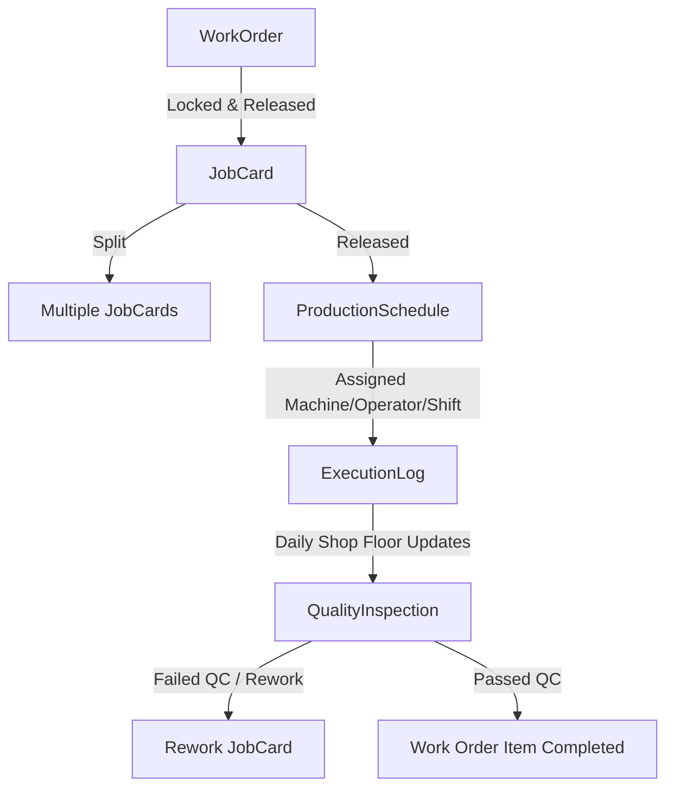

# YashTools ERP — Comprehensive Project Documentation

This file consolidates all documentation regarding the YashTools ERP backend, including core architecture, authentication flows, production module details, database migrations, and operational guidelines.

---

# YashTools Backend - Complete Project Documentation

**Version:** 2.0  
**Last Updated:** May 18, 2026  
**Status:** Active Development  
**Repository:** Git (main, Enquiry, and feature branches)

---

## Table of Contents

1. [Project Overview](#project-overview)
2. [Technology Stack](#technology-stack)
3. [Database Schema](#database-schema)
4. [Project Architecture](#project-architecture)
5. [Implemented Modules](#implemented-modules)
6. [API Endpoints](#api-endpoints)
7. [Authentication & Security](#authentication--security)
8. [Current Issues & Technical Debt](#current-issues--technical-debt)
9. [Features to Implement](#features-to-implement)
10. [Development Guidelines](#development-guidelines)
11. [Git Workflow & Branching](#git-workflow--branching)
12. [Deployment & Environment Setup](#deployment--environment-setup)
13. [Testing Strategy](#testing-strategy)
14. [Performance & Optimization Notes](#performance--optimization-notes)

---

## Project Overview

**YashTools Backend** is a comprehensive ERP (Enterprise Resource Planning) system designed for a tool manufacturing and tool reconditioning business. The system manages:

- **Customer Management** - Company profiles, contact details, business information
- **Enquiry Management** - Request for quotation (RFQ) handling with multi-item support
- **Order Types** - New Tool Manufacturing, Resharpening, Reforming services
- **Labor Management** - Worker tracking, attendance, wage calculations, payouts
- **Master Data** - Coating types, raw materials, tool specifications
- **Authentication & Authorization** - JWT-based role-based access control (RBAC)
- **Audit Logging** - Complete action tracking and compliance logging

### Business Domain Highlights

1. **Three Main Order Types with Specifications:**
   - **NEW_TOOL**: Custom tool manufacturing with material/coating specifications
   - **RESHARPENING**: Tool edge sharpening with optional coating
   - **REFORMING**: Tool body reforming with dimensional specs

2. **Multi-level User Roles:**
   - ADMIN (full system access)
   - SALES (customer/enquiry management)
   - PRODUCTION (manufacturing operations)
   - QUALITY (QA/inspection)
   - FINANCE (accounting & payouts)
   - STORE (inventory management)
   - MANAGER (departmental oversight)
   - CA (Chartered Accountant - finance oversight)
   - USER (general access)

3. **Flexible Labor Wage System:**
   - Hourly wage tracking
   - Piece-rate calculations
   - Daily wage management
   - Weekly payout processing

---

## Technology Stack

### Backend Framework
- **Java:** 21
- **Spring Boot:** 4.1.0-RC1
- **Spring Framework:** Latest (via Spring Boot parent)

### Core Spring Dependencies
- **spring-boot-starter-web** - RESTful API development
- **spring-boot-starter-data-jpa** - ORM (Hibernate) + Data Access
- **spring-boot-starter-security** - Authentication & Authorization
- **spring-boot-starter-validation** - Bean validation (JSR-380)
- **spring-boot-starter-aop** - Aspect-Oriented Programming (audit logging)
- **spring-boot-starter-mail** - Email notifications
- **spring-boot-devtools** - Development convenience (hot reload)

### Database & Persistence
- **PostgreSQL:** 14+ (production database)
- **Flyway:** 12.5.0 (database migration management)
- **postgresql driver:** 42.7.11

### Mapping & Code Generation
- **MapStruct:** 1.5.5.Final (Annotation-based DTO ↔ Entity mapping)
- **Lombok:** 1.18.46 (Boilerplate reduction: @Getter, @Setter, @Builder, etc.)
- **lombok-mapstruct-binding:** 0.2.0 (Bridge between Lombok and MapStruct)

### Security & Token Management
- **JJWT (JWT):** 0.13.0 (JWT token generation/validation)
  - jjwt-api
  - jjwt-impl
  - jjwt-jackson

### API Documentation
- **SpringDoc OpenAPI:** 3.0.3, 2.3.0 (Swagger/OpenAPI documentation)

### File Processing
- **Apache POI:** 5.5.1 (Excel/XLSX file handling for reports)

### Utility
- **JSpecify:** 1.0.0 (Null-safety annotations)

### Testing
- **spring-boot-starter-test** (JUnit 5, Mockito, AssertJ)
- **spring-security-test** (Security testing utilities)

### Build Tool
- **Maven:** 3.x (with maven-compiler-plugin 3.11.0)

---

## Database Schema

### Schema Overview

The database is PostgreSQL 14+ with UUID and numeric ID support. All tables follow consistent naming conventions and include audit timestamps.

### Core Entity Tables

#### 1. **users** (Authentication)
```sql
id: UUID (PK)
name: VARCHAR(255)
email: VARCHAR(255) UNIQUE
password: VARCHAR(255) 
phone: VARCHAR(20)
enabled: BOOLEAN
deleted: BOOLEAN
created_at: TIMESTAMP
```
- Soft delete enabled (@SQLRestriction)
- Many-to-many relationship with roles

#### 2. **role** (Authorization)
```sql
id: UUID (PK)
name: VARCHAR(50) UNIQUE
description: VARCHAR(255)
```

**Default Roles:**
- ROLE_ADMIN
- ROLE_SALES
- ROLE_USER
- ROLE_PRODUCTION
- ROLE_FINANCE
- ROLE_STORE
- ROLE_QUALITY
- ROLE_MANAGER
- ROLE_CA

#### 3. **user_role** (Junction Table)
```sql
user_id: UUID (FK)
role_id: UUID (FK)
PRIMARY KEY (user_id, role_id)
```

#### 4. **customers** (Business)
```sql
id: UUID (PK)
company_name: VARCHAR(255)
customer_name: VARCHAR(255)
legal_entity: VARCHAR(255)
business_type: VARCHAR(255)
mobile_number: VARCHAR(15) UNIQUE
email: VARCHAR(50) UNIQUE
billing_address: VARCHAR(255)
delivery_address: VARCHAR(255)
gst_number: VARCHAR(20)
status: VARCHAR(20) [ACTIVE, INACTIVE, SUSPENDED, PENDING, DELETED]
is_deleted: BOOLEAN

# Audit fields
created_at: TIMESTAMP
updated_at: TIMESTAMP
created_by: VARCHAR(255)
updated_by: VARCHAR(255)
```
- Indexes: status, is_deleted, email, mobile_number

#### 5. **enquiries** (Root Aggregate)
```sql
id: UUID (PK)
enquiry_no: VARCHAR(20) UNIQUE [Format: ENQ-YYYY-####]
customer_id: UUID (FK)
is_urgent: BOOLEAN
status: VARCHAR(20) [CREATED, UNDER_REVIEW, QUOTED, ACCEPTED, CLOSED]
remarks: TEXT

# Audit fields
created_at: TIMESTAMP
updated_at: TIMESTAMP
created_by: VARCHAR(255)
updated_by: VARCHAR(255)
```
- Indexes: enquiry_no, status, customer_id, created_at, is_urgent

#### 6. **enquiry_items** (Line Items)
```sql
id: UUID (PK)
enquiry_id: UUID (FK - CASCADE DELETE)
order_type: VARCHAR(20) [NEW_TOOL, RESHARPENING, REFORMING]
tool_name: VARCHAR(200)
quantity: INTEGER (CHECK > 0)
trial: BOOLEAN [Max qty 1 if trial=true]
remarks: TEXT
drawing_reference: VARCHAR(500)
sample_provided: BOOLEAN
```

#### 7. **new_tool_specs** (Manufacturing Specifications)
```sql
id: UUID (PK)
enquiry_item_id: UUID (FK - UNIQUE, CASCADE DELETE)
material_type: VARCHAR(30) [HSS, CARBIDE, COBALT_HSS, PM_HSS, TOOL_STEEL]
material_grade: VARCHAR(30) [M2, M35, M42, K10, K20, K30, O1, A2, D2, ASP23, ASP30]
coating_required: BOOLEAN
coating_type: VARCHAR(30) [HELICA, ALCRONA, VICIOUS_BLACK, VICIOUS_BROWN]
diameter: DOUBLE PRECISION (CHECK > 0)
flute_length: DOUBLE PRECISION (CHECK > 0)
shank_diameter: DOUBLE PRECISION (CHECK > 0)
overall_length: DOUBLE PRECISION (CHECK > 0)
technical_notes: TEXT
```

#### 8. **resharpening_specs** (Sharpening Specifications)
```sql
id: UUID (PK)
enquiry_item_id: UUID (FK - UNIQUE, CASCADE DELETE)
resharpening_type: VARCHAR(20) [PRIMARY, SECONDARY, FULL]
coating_required: BOOLEAN
coating_type: VARCHAR(30) [HELICA, ALCRONA, VICIOUS_BLACK, VICIOUS_BROWN]
technical_notes: TEXT
```

#### 9. **reforming_specs** (Reforming Specifications)
```sql
id: UUID (PK)
enquiry_item_id: UUID (FK - UNIQUE, CASCADE DELETE)
coating_required: BOOLEAN
coating_type: VARCHAR(30) [HELICA, ALCRONA, VICIOUS_BLACK, VICIOUS_BROWN]
flute_length: DOUBLE PRECISION (CHECK > 0)
technical_notes: TEXT
```

#### 10. **coatings** (Master Data)
```sql
id: BIGINT (Identity)
name: VARCHAR(255) UNIQUE
coating_type: VARCHAR(50) [HELICA, ALCRONA, VICIOUS_BLACK, VICIOUS_BROWN]
rate: DOUBLE PRECISION
active: BOOLEAN
```

#### 11. **raw_materials** (Master Data)
```sql
id: BIGINT (Identity)
name: VARCHAR(255) UNIQUE
rate: DOUBLE PRECISION
active: BOOLEAN
```

#### 12. **audit_log** (Compliance)
```sql
id: UUID (PK)
user_id: UUID (FK - SET NULL on delete)
action: VARCHAR(255)
entity_name: VARCHAR(255)
entity_id: VARCHAR(255)
description: TEXT
ip_address: VARCHAR(100)
user_agent: TEXT
created_at: TIMESTAMP
```
- Indexes: user_id, created_at, action

#### 13. **laborers** (Labor Management)
```sql
id: BIGINT (Identity, PK)
name: VARCHAR(255)
ph_number: VARCHAR(20)
email: VARCHAR(255)
address: TEXT
labor_role: VARCHAR(50) [MACHINIST, HELPER, SUPERVISOR, etc.]
wage_type: VARCHAR(20) [HOURLY, PIECE_RATE, DAILY]
daily_wage: DECIMAL(19, 2)
piece_rate: DECIMAL(19, 2)
hourly_rate: DECIMAL(19, 2)
is_active: BOOLEAN
```

#### 14. **attendance** (Labor Tracking)
```sql
id: BIGINT (Identity, PK)
laborer_id: BIGINT (FK)
attendance_date: DATE
present: BOOLEAN
hours_worked: DOUBLE PRECISION
remarks: TEXT
created_at: TIMESTAMP
```

#### 15. **weekly_payouts** (Payment Management)
```sql
id: BIGINT (Identity, PK)
laborer_id: BIGINT (FK)
week_started: DATE
week_ended: DATE
gross_amount: DECIMAL(19, 2)
advance_deducted: DECIMAL(19, 2)
net_amount: DECIMAL(19, 2)
payment_status: VARCHAR(20) [PENDING, PAID, CANCELLED]
paid_on: TIMESTAMP
```

#### 16. **advance_transactions** (Labor Advances)
```sql
id: BIGINT (Identity, PK)
laborer_id: BIGINT (FK)
transaction_type: VARCHAR(20) [ADVANCE_GIVEN, ADVANCE_DEDUCTED]
amount: DECIMAL(19, 2)
transaction_date: TIMESTAMP
remarks: TEXT
```

#### 17. **refresh_token** (JWT Management)
```sql
id: UUID (PK)
user_id: UUID (FK)
token: TEXT
expiry_date: TIMESTAMP
```

### Database Views

**v_active_enquiries** - Real-time dashboard view
- Shows non-closed enquiries with customer details and item counts
- Includes trial flags for quick identification
- OrderBy: created_at DESC for latest first

**v_enquiry_items_summary** - Specification aggregation
- Maps items to their spec types
- Consolidates coating requirements across all spec types
- Includes material info for NEW_TOOL specs

### Database Functions

#### `generate_enquiry_number()`
Generates unique enquiry numbers with format: `ENQ-YYYY-####`
- Resets sequence on new year
- Auto-increments within year

#### `validate_trial_quantity()`
Enforces business rule: Trial items must have quantity = 1

#### `update_timestamp()`
Auto-updates `updated_at` on record changes

---

## Project Architecture

### Layered Architecture Pattern

```
┌─────────────────────────────────────────────────────┐
│         REST Controllers (API Layer)                │
│  @RestController, @RequestMapping, @PreAuthorize   │
└──────────────────────┬──────────────────────────────┘
                       │
┌──────────────────────────────────────────────────────┐
│         Service Layer (Business Logic)               │
│  @Service, @Transactional, Business Rules           │
└──────────────────────┬──────────────────────────────┘
                       │
┌──────────────────────────────────────────────────────┐
│         Repository Layer (Data Access)               │
│  Spring Data JPA, @Repository, Custom Queries       │
└──────────────────────┬──────────────────────────────┘
                       │
┌──────────────────────────────────────────────────────┐
│         Persistence Layer (Database)                 │
│  PostgreSQL 14+, Flyway Migrations, JDBC Driver    │
└──────────────────────────────────────────────────────┘
```

### Cross-Cutting Concerns

```
┌────────────────────────────────────────┐
│  JWT Authentication Filter             │
│  @Component, GenericFilterBean         │
│  - Token validation                    │
│  - Principal extraction                │
│  - Security context setup              │
└────────────────────────────────────────┘

┌────────────────────────────────────────┐
│  Exception Handling                    │
│  @RestControllerAdvice                 │
│  - GlobalExceptionHandler              │
│  - JwtAuthenticationEntryPoint         │
│  - JwtAccessDeniedHandler              │
└────────────────────────────────────────┘

┌────────────────────────────────────────┐
│  Audit Logging (AOP)                   │
│  @Aspect, @Around Advice               │
│  - AuditLogAspect                      │
│  - @LoggableAction annotations         │
│  - User action tracking                │
└────────────────────────────────────────┘

┌────────────────────────────────────────┐
│  Data Mapping                          │
│  MapStruct Mappers                     │
│  - DTO ↔ Entity mapping                │
│  - Complex nested object resolution    │
└────────────────────────────────────────┘
```

### Directory Structure

```
com/kalibyte/YashTools/
│
├── YashToolBackEndApplication.java     # Spring Boot entry point
│
├── auth/                               # Authentication & Authorization
│   ├── bootstrap/                      # Initial data setup
│   │   ├── AdminBootstrap.java
│   │   └── RoleBootstrap.java
│   ├── controller/
│   │   ├── AuthController.java         # Login, logout, token refresh
│   │   └── UserManagementController.java
│   ├── dto/                            # Data Transfer Objects
│   │   ├── LoginRequest/Response
│   │   ├── TokenRefresh*
│   │   ├── ChangePasswordRequest
│   │   └── UserRegistrationRequest/Response
│   ├── entity/
│   │   ├── User.java
│   │   ├── Role.java
│   │   ├── RefreshToken.java
│   │   ├── AuditLog.java
│   │   └── enums/RoleName.java
│   ├── mapper/AuthMapper.java
│   ├── repository/
│   │   ├── UserRepository.java
│   │   ├── RoleRepository.java
│   │   ├── RefreshTokenRepository.java
│   │   └── AuditLogRepository.java
│   ├── security/
│   │   ├── config/SecurityConfig.java
│   │   ├── filter/JwtAuthenticationFilter.java
│   │   ├── handler/
│   │   │   ├── JwtAuthenticationEntryPoint.java
│   │   │   └── JwtAccessDeniedHandler.java
│   │   └── token/
│   │       ├── JwtTokenProvider.java
│   │       ├── CustomUserDetails.java
│   │       └── CustomUserDetailsService.java
│   ├── service/
│   │   ├── AuthService.java (interface)
│   │   ├── UserService.java (interface)
│   │   ├── RefreshTokenService.java
│   │   └── impl/
│   │       ├── AuthServiceImpl.java
│   │       └── UserServiceImpl.java
│
├── customer/                           # Customer Management Module
│   ├── controller/CustomerController.java
│   ├── dto/
│   │   ├── CustomerRequest.java
│   │   └── CustomerResponse.java
│   ├── entity/
│   │   ├── Customer.java
│   │   └── enums/CustomerStatus.java
│   ├── mapper/CustomerMapper.java
│   ├── repository/CustomerRepository.java
│   ├── service/
│   │   ├── CustomerService.java (interface)
│   │   └── impl/CustomerServiceImpl.java
│
├── enquiry/                            # Enquiry Management Module (Main Business Logic)
│   ├── controller/EnquiryController.java
│   ├── dto/
│   │   ├── request/
│   │   │   ├── CreateEnquiryRequest.java
│   │   │   ├── EnquiryItemRequest.java
│   │   │   ├── NewToolSpecsRequest.java
│   │   │   ├── ReformingSpecsRequest.java
│   │   │   ├── ResharpeningSpecsRequest.java
│   │   │   └── UpdateEnquiryStatusRequest.java
│   │   └── response/
│   │       ├── EnquiryResponse.java
│   │       ├── EnquiryItemResponse.java
│   │       ├── NewToolSpecsResponse.java
│   │       ├── ReformingSpecsResponse.java
│   │       └── ResharpeningSpecsResponse.java
│   ├── entity/
│   │   ├── Enquiry.java               # Root aggregate
│   │   ├── EnquiryItem.java
│   │   ├── NewToolSpecs.java
│   │   ├── ReformingSpecs.java
│   │   ├── ResharpeningSpecs.java
│   │   └── enums/
│   │       ├── EnquiryStatus.java
│   │       ├── MaterialType.java
│   │       ├── MaterialGrade.java
│   │       └── CoatingRequirement.java
│   ├── mapper/EnquiryMapper.java
│   ├── repository/
│   │   ├── EnquiryRepository.java
│   │   ├── EnquiryItemRepository.java
│   │   ├── NewToolSpecsRepository.java
│   │   ├── ReformingSpecsRepository.java
│   │   └── ResharpeningSpecsRepository.java
│   ├── service/
│   │   ├── EnquiryService.java (interface)
│   │   └── impl/
│   │       ├── EnquiryServiceImpl.java
│   │       ├── EnquiryValidationService.java
│   │       └── EnquirySecurityService.java
│
├── master/                             # Master Data Management
│   ├── coating/
│   │   ├── controller/CoatingController.java
│   │   ├── dto/
│   │   │   ├── CoatingRequest.java
│   │   │   └── CoatingResponse.java
│   │   ├── entity/Coating.java
│   │   ├── mapper/CoatingMapper.java
│   │   ├── repository/CoatingRepository.java
│   │   ├── service/ (CoatingService interface + impl)
│   │
│   └── rawmaterial/
│       ├── controller/RawMaterialController.java
│       ├── dto/
│       │   ├── RawMaterialRequest.java
│       │   └── RawMaterialResponse.java
│       ├── entity/RawMaterial.java
│       ├── mapper/RawMaterialMapper.java
│       ├── repository/RawMaterialRepository.java
│       └── service/ (RawMaterialService interface + impl)
│
├── labors/                             # Labor Management Module
│   ├── labor/
│   │   ├── controller/LaborerController.java
│   │   ├── dto/
│   │   │   ├── LaborerRequestDTO.java
│   │   │   └── LaborerResponseDTO.java
│   │   ├── entity/
│   │   │   ├── Laborer.java
│   │   │   └── Enum/
│   │   │       ├── LaborRole.java
│   │   │       └── WageType.java
│   │   ├── mapper/LaborerMapper.java
│   │   ├── repository/LaborerRepository.java
│   │   ├── exception/LaborException.java
│   │   └── service/LaborerService.java
│   │
│   ├── attendance/
│   │   ├── controller/AttendanceController.java
│   │   ├── dto/
│   │   │   ├── AttendanceRequestDTO.java
│   │   │   ├── AttendanceResponseDTO.java
│   │   │   └── BulkAttendanceRequestDTO.java
│   │   ├── entity/Attendance.java
│   │   ├── mapper/AttendanceMapper.java
│   │   ├── repository/AttendanceRepository.java
│   │   ├── exceptions/DuplicateAttendance.java
│   │   └── service/AttendanceService.java
│   │
│   ├── payout/
│   │   ├── controller/PayoutController.java
│   │   ├── dto/
│   │   │   ├── WeeklyPayoutRequestDTO.java
│   │   │   ├── WeeklyPayoutResponseDTO.java
│   │   │   └── DisbursePayoutRequestDTO.java
│   │   ├── entity/
│   │   │   ├── WeeklyPayout.java
│   │   │   └── Enum/PaymentStatus.java
│   │   ├── mapper/WeeklyPayoutMapper.java
│   │   ├── repository/WeeklyPayoutRepository.java
│   │   ├── exception/PayoutException.java
│   │   └── service/WeeklyPayoutService.java
│   │
│   ├── advance/
│   │   ├── controller/AdvanceController.java
│   │   ├── dto/
│   │   │   ├── AdvanceTransactionRequestDTO.java
│   │   │   └── AdvanceTransactionResponseDTO.java
│   │   ├── entity/
│   │   │   ├── AdvanceTransaction.java
│   │   │   └── Enum/TransactionType.java
│   │   ├── mapper/AdvanceTransactionMapper.java
│   │   ├── repository/AdvanceTransactionRepository.java
│   │   └── service/AdvanceService.java
│   │
│   ├── report/                          # Unified Reporting & Financial Engine
│   │   ├── controller/
│   │   │   ├── LaborReportController.java
│   │   │   └── ProductionReportController.java
│   │   ├── dto/
│   │   │   ├── DateRangeRequest.java
│   │   │   ├── DateRangePreset.java
│   │   │   ├── LaborDetailedReportDTO.java
│   │   │   ├── LaborExpenseReportDTO.java
│   │   │   ├── ProductionExecutionReportDTO.java
│   │   │   ├── ProductionExecutionDetailDTO.java
│   │   │   ├── QualityInspectionReportDTO.java
│   │   │   ├── QualityInspectionDetailDTO.java
│   │   │   ├── CoatingUtilizationReportDTO.java
│   │   │   ├── CoatingUtilizationDetailDTO.java
│   │   │   ├── ProductionEfficiencyReportDTO.java
│   │   │   ├── ProductionEfficiencyDetailDTO.java
│   │   │   └── ProfitLossReportDTO.java
│   │   ├── util/DateRangeResolver.java
│   │   └── service/
│   │       ├── LaborReportService.java
│   │       └── ProductionReportService.java
│   │
│   └── seeder/LaborDatabaseSeeder.java
│
├── common/                             # Cross-Cutting Concerns
│   ├── annotation/
│   │   └── LoggableAction.java        # Custom annotation for audit logging
│   ├── aspect/
│   │   └── AuditLogAspect.java        # AOP advice for @LoggableAction
│   ├── base/
│   │   ├── BaseEntity.java            # UUID + timestamp base class
│   │   └── AuditableEntity.java       # Audit fields + @CreatedBy/@LastModifiedBy
│   ├── config/
│   │   ├── OpenAPIConfig.java         # Swagger/OpenAPI configuration
│   │   ├── JpaAuditingConfig.java     # Spring Data JPA auditing
│   │   └── (SecurityConfig.java moved to auth/security/config)
│   ├── enums/
│   │   ├── OrderType.java             # NEW_TOOL, RESHARPENING, REFORMING
│   │   ├── CoatingType.java
│   │   └── ResharpeningType.java
│   ├── exception/
│   │   ├── GlobalExceptionHandler.java
│   │   ├── BusinessException.java
│   │   ├── BusinessValidationException.java
│   │   ├── ResourceNotFoundException.java
│   │   └── UnauthorizedException.java
│   ├── response/
│   │   ├── ApiResponse.java           # Standard API response wrapper
│   │   └── PageResponse.java          # Pagination wrapper
│   ├── service/
│   │   └── AuditorAwareImpl.java       # JPA auditing implementation
│   └── util/
│       ├── SecurityUtils.java
│       ├── SecurityService.java
│       ├── PaginationUtils.java
│       ├── NumberGeneratorUtil.java
│       ├── DateUtils.java
│       └── PasswordValidator.java
│
└── resources/
    ├── application.yaml
    ├── application-dev.yaml
    ├── application-prod.yaml
    └── db/
        └── migration/
            └── V1__init_all_tables.sql
```

---

## Implemented Modules

### 1. **Authentication & Authorization Module**

**Features:**
- JWT-based stateless authentication
- Role-based access control (RBAC) with 9 predefined roles
- Token refresh mechanism with separate expiration
- Password change functionality with validation
- Audit log tracking of all authentication actions

**Key Components:**
- `AuthController` - Login, logout, token refresh endpoints
- `JwtTokenProvider` - Token generation/validation
- `CustomUserDetailsService` - User principal loading
- `JwtAuthenticationFilter` - Request interceptor for JWT validation

**Security Config:**
- CORS enabled for local dev (localhost:3000, localhost:5173)
- CSRF disabled (stateless JWT)
- Public endpoints: /api/auth/login, /api/auth/refresh
- All other endpoints require authentication

**Current Issues:**
- No rate limiting on login endpoint (CWE-779)
- No account lockout after failed attempts

---

### 2. **Customer Management Module**

**Features:**
- Create/Read customer profiles
- Customer status tracking (ACTIVE, INACTIVE, SUSPENDED, PENDING, DELETED)
- Contact information management (email, mobile validation)
- Address management (billing + delivery)
- GST number storage for taxation
- Soft delete support

**REST Endpoints:**
- `POST /api/customers` - Create customer
- `GET /api/customers/{id}` - Get by ID
- `GET /api/customers` - List all
- `PUT /api/customers/{id}` - Update
- `DELETE /api/customers/{id}` - Soft delete

**Roles Required:** ADMIN, SALES

---

### 3. **Enquiry Management Module** (Main Business Logic)

**Features:**
- Multi-item enquiry creation with automatic number generation
- Three order types with distinct specifications:
  - **NEW_TOOL**: Material type, grade, dimensions, coating
  - **RESHARPENING**: Resharpening type, optional coating
  - **REFORMING**: Dimensional requirements, coating
- Enquiry status state machine (CREATED → UNDER_REVIEW → QUOTED → ACCEPTED → CLOSED)
- Trial item support (max qty: 1)
- Urgent enquiry flagging
- Complete audit trail on status changes
- Bidirectional relationship management (Enquiry ↔ Items ↔ Specs)

**REST Endpoints:**
- `POST /api/enquiries` - Create enquiry with nested items
- `GET /api/enquiries/{id}` - Get enquiry with all specs
- `GET /api/enquiries` - List all enquiries
- `GET /api/enquiries/customer/{customerId}` - Get by customer
- `PATCH /api/enquiries/{id}/status` - Update status

**Roles Required:** ADMIN, SALES

**Business Rules Enforced:**
1. Enquiry must have at least one item
2. Trial items limited to quantity = 1 (database trigger + service validation)
3. Status transitions validated (no backward transitions)
4. Customer must exist before enquiry creation
5. Item order type must match specification type (NEW_TOOL → NewToolSpecs, etc.)

**Key Classes:**
- `Enquiry.java` - Root aggregate entity
- `EnquiryServiceImpl` - Business orchestration
- `EnquiryValidationService` - Validation rules
- `EnquirySecurityService` - Authorization checks
- `EnquiryMapper` - Complex nested mapping

---

### 4. **Master Data Management Module**

**Submodules:**

#### 4A. **Coating Management**
- CRUD operations for coating types
- Rate management for pricing
- Active/inactive status

**Coating Types:** HELICA, ALCRONA, VICIOUS_BLACK, VICIOUS_BROWN

#### 4B. **Raw Material Management**
- CRUD operations for material inventory
- Material rate tracking
- Active status flag

**REST Endpoints:** `/api/master/coatings`, `/api/master/raw-materials`

---

### 5. **Labor Management Module**

**Submodules:**

#### 5A. **Labor/Laborer Management**
- Record laborer profiles
- Multiple wage types: HOURLY, PIECE_RATE, DAILY
- Various labor roles: MACHINIST, HELPER, SUPERVISOR, etc.
- Active/inactive status

#### 5B. **Attendance Tracking**
- Daily attendance marking
- Hours worked tracking
- Bulk attendance upload support
- Duplicate prevention

#### 5C. **Weekly Payout Processing**
- Automatic weekly payout calculations
- Advance deduction tracking
- Payment status management (PENDING, PAID, CANCELLED)
- Payment disbursement tracking

#### 5D. **Advance Management**
- Track labor advances given
- Deduction tracking against payouts
- Advance transaction history

#### 5E. **Unified Reporting & Financial Analytics Engine**
- **Labor Expense Reports:** Tracking daily, weekly, monthly, and yearly payouts, attendance summaries, and advance deductions.
- **Production Execution Logs:** Real-time logging of target vs. produced quantities, operator shifts, machine allocations, and downtime tracking.
- **Quality Audits (QA):** Pass, reject, and rework logs checking inspection rates by inspector or inspection results.
- **Coating Utilization Logs:** Matching chemical utilization (Helica, Alcrona, etc.) rates against actual quantities run on the floor to track chemical cost.
- **Production Efficiency Reports:** Calculating machine productivity and process efficiency by order category type (`NEW_TOOL`, `RESHARPENING`, `REFORMING`).
- **Profit & Loss (P&L) Reports:** Aggregates live sales invoices revenue, collected GST taxes, carbide raw material purchases, direct wages, and overhead shipping/logistics expenses to compute net profits and margins.
- **Multi-Format Exports:** High-quality Excel spreadsheets (Apache POI) and print-ready PDF statements (Thymeleaf + Flying Saucer).
- **Date Presets resolver:** Native support for presets (`TODAY`, `YESTERDAY`, `THIS_WEEK`, `THIS_MONTH`, `THIS_QUARTER`, `THIS_YEAR`, etc.) and custom ranges.

---

### 6. **Audit Logging & Compliance**

**Features:**
- AOP-based automatic action logging
- IP address tracking
- User agent capture
- Custom `@LoggableAction` annotation for marking methods to audit

**Audit Fields Captured:**
- User ID who performed action
- Action name (method name)
- Entity type and ID
- Timestamp
- IP address
- User agent

**Database Table:** `audit_log`

---

## API Endpoints

### Base URL
```
http://localhost:8080/api
```

### Authentication Endpoints

| Method | Endpoint | Description | Auth Required |
|--------|----------|-------------|------------------|
| POST | `/auth/login` | User login | No |
| POST | `/auth/refresh` | Refresh JWT token | No |
| POST | `/auth/logout` | User logout | Yes |
| POST | `/auth/change-password` | Change password | Yes |

### Customer Endpoints

| Method | Endpoint | Description | Roles |
|--------|----------|-------------|-------|
| POST | `/customers` | Create customer | ADMIN, SALES |
| GET | `/customers/{id}` | Get customer by ID | ADMIN, SALES |
| GET | `/customers` | List all customers | ADMIN, SALES |
| PUT | `/customers/{id}` | Update customer | ADMIN, SALES |
| DELETE | `/customers/{id}` | Delete customer (soft) | ADMIN |

### Enquiry Endpoints

| Method | Endpoint | Description | Roles |
|--------|----------|-------------|-------|
| POST | `/enquiries` | Create enquiry | ADMIN, SALES |
| GET | `/enquiries/{id}` | Get enquiry | ADMIN, SALES |
| GET | `/enquiries` | List all enquiries | ADMIN, SALES |
| GET | `/enquiries/customer/{customerId}` | Get by customer | ADMIN, SALES |
| PATCH | `/enquiries/{id}/status` | Update status | ADMIN, SALES |

### Master Data Endpoints

| Method | Endpoint | Description | Roles |
|--------|----------|-------------|-------|
| POST | `/master/coatings` | Create coating | ADMIN |
| GET | `/master/coatings` | List coatings | ADMIN, PRODUCTION |
| POST | `/master/raw-materials` | Create material | ADMIN |
| GET | `/master/raw-materials` | List materials | ADMIN, PRODUCTION |

### Labor Endpoints

| Method | Endpoint | Description | Roles |
|--------|----------|-------------|-------|
| POST | `/labors/laborers` | Create laborer | ADMIN, HR |
| GET | `/labors/laborers` | List laborers | ADMIN, HR |
| POST | `/labors/attendance` | Mark attendance | ADMIN, HR |
| POST | `/labors/attendance/bulk` | Bulk attendance upload | ADMIN, HR |
| GET | `/labors/payouts` | Get payouts | ADMIN, FINANCE |
| POST | `/labors/payouts` | Create weekly payout | ADMIN, FINANCE |
| POST | `/labors/advances` | Record advance | ADMIN, HR, FINANCE |

### Unified Reports & Financials Endpoints

| Method | Endpoint | Description | Roles / Permissions |
|--------|----------|-------------|---------------------|
| **Labor Reports** | | | |
| GET | `/api/labor-reports/summary` | Aggregated labor expense summary (preset/dates) | ADMIN, FINANCE |
| GET | `/api/labor-reports/weekly` | Weekly attendance & earnings report | ADMIN, FINANCE |
| GET | `/api/labor-reports/monthly` | Monthly attendance & earnings report | ADMIN, FINANCE |
| GET | `/api/labor-reports/yearly/{year}` | Yearly labor cost rollup | ADMIN, FINANCE |
| GET | `/api/labor-reports/export` | Export labor summary to Excel | ADMIN, FINANCE |
| **Production Reports** | | | |
| GET | `/api/production-reports/execution` | Shop-floor execution logs (target vs produced) | ADMIN, PRODUCTION, FINANCE |
| GET | `/api/production-reports/execution/export-excel` | Export execution log summary to Excel | ADMIN, PRODUCTION, FINANCE |
| GET | `/api/production-reports/execution/export-pdf` | Export execution log summary to PDF | ADMIN, PRODUCTION, FINANCE |
| GET | `/api/production-reports/quality` | QA audits summary (pass, reject, rework rates) | ADMIN, PRODUCTION, FINANCE |
| GET | `/api/production-reports/quality/export-excel` | Export QA audit summary to Excel | ADMIN, PRODUCTION, FINANCE |
| GET | `/api/production-reports/quality/export-pdf` | Export QA audit summary to PDF | ADMIN, PRODUCTION, FINANCE |
| GET | `/api/production-reports/coating` | Coating utilization & chemical cost log | ADMIN, PRODUCTION, FINANCE |
| GET | `/api/production-reports/coating/export-excel` | Export coating utilization log to Excel | ADMIN, PRODUCTION, FINANCE |
| GET | `/api/production-reports/coating/export-pdf` | Export coating utilization log to PDF | ADMIN, PRODUCTION, FINANCE |
| GET | `/api/production-reports/efficiency` | Category productivity efficiency logs | ADMIN, PRODUCTION, FINANCE |
| GET | `/api/production-reports/efficiency/export-excel` | Export category productivity logs to Excel | ADMIN, PRODUCTION, FINANCE |
| GET | `/api/production-reports/efficiency/export-pdf` | Export category productivity logs to PDF | ADMIN, PRODUCTION, FINANCE |
| **Profit & Loss Reports** | | | |
| GET | `/api/production-reports/profit-loss` | Financial P&L Statement (revenue, costs, margins) | ADMIN, FINANCE |
| GET | `/api/production-reports/profit-loss/export-excel` | Export P&L statement to Excel | ADMIN, FINANCE |
| GET | `/api/production-reports/profit-loss/export-pdf` | Export P&L statement to PDF | ADMIN, FINANCE |

### Actuator Endpoints (Management)

| Method | Endpoint | Description |
|--------|----------|-------------|
| GET | `/actuator/health` | System health status |
| GET | `/actuator/info` | Application info |

---

## Authentication & Security

### JWT Implementation

**Token Structure:**
```
Header: {
  "alg": "HS256",
  "typ": "JWT"
}

Payload: {
  "sub": "user_email",
  "iat": 1234567890,
  "exp": 1234567890 + 604800000,  # 7 days
  "roles": ["ROLE_SALES", "ROLE_USER"]
}

Signature: HMAC-SHA256(secret)
```

**Configuration:**
- Token Expiration: 604800000 ms (7 days)
- Refresh Expiration: 604800000 ms (7 days)
- Secret: $JWT_SECRET (environment variable)

### Security Filters & Handlers

1. **JwtAuthenticationFilter** - Validates token on every request
2. **JwtAuthenticationEntryPoint** - Handles missing/invalid token
3. **JwtAccessDeniedHandler** - Handles authorization failures

### RBAC Implementation

**Authorization Pattern:**
```java
@PreAuthorize("hasAnyRole('ADMIN', 'SALES')")
public ResponseEntity<?> createEnquiry(...) { }
```

**Custom Security Checks:**
```java
@PreAuthorize("@enquirySecurityService.canAccessEnquiry(#id)")
public ResponseEntity<?> getEnquiry(@PathVariable UUID id) { }
```

### Known Security Issues

1. **Hardcoded Secrets** (CWE-798)
   - Default admin password in application.yaml
   - Should be environment-only

2. **Error Message Exposure** (CWE-209)
   - Raw exception messages returned to client
   - Should log server-side, return generic client messages

3. **Missing Rate Limiting** (CWE-779)
   - No brute-force protection on login
   - No DoS protection on expensive endpoints
   - **TODO:** Implement Bucket4j or Spring Cloud RateLimiter

4. **Potential IDOR** (CWE-639)
   - RBAC checked but no ownership verification
   - **TODO:** Add resource-level authorization checks

### CORS Configuration

**Allowed Origins (Dev):**
- http://localhost:3000
- http://localhost:5173

**Allowed Methods:** GET, POST, PUT, DELETE, PATCH, OPTIONS

**CSRF:** Disabled (stateless JWT)

---

## Current Issues & Technical Debt

### Critical Issues

1. **Hardcoded Secrets in Configuration**
   - **File:** `src/main/resources/application.yaml`
   - **Severity:** CRITICAL
   - **Issue:** JWT_SECRET, database credentials, admin password hardcoded
   - **Resolution:** Move all secrets to environment variables with no defaults

2. **Generic Error Responses Expose Details**
   - **File:** `GlobalExceptionHandler.java`
   - **Severity:** HIGH
   - **Issue:** Raw exception messages returned to clients
   - **Resolution:** Log fully server-side, return generic messages to client

3. **No Rate Limiting**
   - **Severity:** HIGH
   - **Issue:** Vulnerable to brute-force attacks on /api/auth/login
   - **Resolution:** Add rate limiting using Bucket4j

### Medium Priority Issues

4. **Missing Ownership-Based Authorization**
   - **Severity:** MEDIUM
   - **Issue:** RBAC only, no resource ownership checks
   - **Resolution:** Add @PostAuthorize or explicit authorization checks in service layer

5. **Incomplete Mapper Field Alignment**
   - **File:** `EnquiryMapper.java`
   - **Severity:** MEDIUM
   - **Issue:** Field naming inconsistencies (trial vs isTrial, coatingRequirement vs coating)
   - **Resolution:** Standardize naming throughout DTOs/entities

6. **Missing Integration Tests**
   - **Severity:** MEDIUM
   - **Issue:** No @SpringBootTest test suite for end-to-end flows
   - **Resolution:** Add comprehensive integration tests

### Low Priority Issues

7. **RC Spring Boot Version**
   - **Version:** 4.1.0-RC1
   - **Recommendation:** Upgrade to stable GA version

8. **CORS Hardcoded for Dev**
   - **Current:** localhost:3000, localhost:5173
   - **To Fix:** Make environment-specific

9. **Limited Exception Types**
   - **Issue:** Few custom exceptions defined
   - **To Improve:** Add more specific exception hierarchy

---

## Features to Implement

### Phase 1: Security Hardening (URGENT)

**Priority: CRITICAL**

1. **Rate Limiting Implementation**
   - Add Bucket4j dependency
   - Implement RateLimitingInterceptor
   - Apply stricter limits to /api/auth/login (5 attempts/minute)
   - Apply global limits (100 requests/minute per IP)

2. **Secrets Management**
   - Remove hardcoded seeds from application.yaml
   - Create separate application-secret.yaml (git-ignored)
   - Validate all required env vars at startup
   - Add Spring Cloud Config or HashiCorp Vault integration

3. **Global Error Handling Improvement**
   - Create ErrorResponse DTO
   - Log full stack traces server-side
   - Return sanitized generic messages to clients
   - Include error codes for client-side handling

4. **Resource-Level Authorization**
   - Add @PostAuthorize in service methods
   - Implement ownership checks
   - Create AuthorizationService for complex rules
   - Add API-level authorization tests

### Phase 2: Feature Enhancement (HIGH)

**Priority: HIGH**

1. **Quotation Module**
   - Create Quotation entity (FK to Enquiry)
   - Generate quotations with item-level pricing
   - Track quotation status (DRAFT, SENT, ACCEPTED, REJECTED, EXPIRED)
   - Email quotation to customer
   - PDF export of quotations

2. **Purchase Order Module**
   - Create PurchaseOrder entity (from accepted Quotation)
   - Track PO status (CREATED, CONFIRMED, PARTIAL_DELIVERED, DELIVERED, CANCELLED)
   - Link to customer enquiry
   - PO line item tracking

3. **Production Scheduling**
   - Create ProductionSchedule entity
   - Assign laborers to jobs
   - Track production status (NOT_STARTED, IN_PROGRESS, COMPLETED)
   - Generate production reports by labor/time period

4. **Quality Assessment Module**
   - Create QualityCheck entity
   - Track inspection results (PASS, FAIL, REWORK)
   - Link to production orders
   - Generate quality reports

5. **Inventory Management**
   - Raw material stock tracking
   - In-process inventory (WIP)
   - Finished goods inventory
   - Stock movement ledger

### Phase 3: Reporting & Analytics (MEDIUM)

**Priority: MEDIUM**

1. **Advanced Reporting Dashboard**
   - Customer-wise enquiry pipeline (CREATED → CLOSED)
   - Revenue dashboard (invoiced vs pending)
   - Labor productivity metrics
   - Production efficiency by order type
   - Coating utilization reports

2. **Excel/PDF Export**
   - Dynamic report export generation
   - Jasper reports integration for complex PDF layouts
   - Scheduled report generation (daily/weekly digests)

3. **Business Intelligence Queries**
   - Most profitable customers
   - Fastest/slowest orders to complete
   - Labor productivity trends
   - Order delay analysis

### Phase 4: Workflow & Automation (MEDIUM)

**Priority: MEDIUM**

1. **Email Notifications**
   - Enquiry status change notifications (to customer & internal)
   - Quotation sent/expiry reminders
   - Production order completion alerts
   - Labor advance/payout notifications

2. **Workflow Automations**
   - Auto-generate quotation after enquiry review
   - Auto-create production schedule on PO confirmation
   - Auto-calculate payouts on week-end

3. **Approval Workflows**
   - Multi-level quotation approval (SM → Manager → Finance)
   - Production order approval
   - Payout approval (for high amounts)

### Phase 5: Client Portal (LOWER)

**Priority: LOWER**

1. **Customer Self-Service Portal**
   - Customer-specific enquiry visibility
   - Quotation tracking & acceptance
   - Order status tracking
   - Document downloads (invoices, delivery challan)

2. **Laborer Portal**
   - View attendance records
   - Track payouts
   - View advance balance
   - Download payslips

### Phase 6: Administration & Maintenance (ONGOING)

**Priority: ONGOING**

1. **Enhanced Admin Panel**
   - User management (create, disable, role assignment)
   - Role & permission management
   - System configuration management
   - Data backup/restore utilities

2. **System Maintenance**
   - Database cleanup procedures
   - Archive old records
   - Performance optimization
   - Log archival

3. **Monitoring & Observability**
   - Add structured logging (SLF4J + Logback)
   - Request correlation IDs
   - Performance metrics (response time, throughput)
   - Health check enhancements

---

## Development Guidelines

### Code Style & Standards

1. **Naming Conventions:**
   - Classes: PascalCase (CustomerService, EnquiryResponse)
   - Methods: camelCase (createEnquiry, getAllCustomers)
   - Constants: UPPER_SNAKE_CASE (MAX_QUANTITY, DEFAULT_PAGE_SIZE)
   - Database columns: snake_case (customer_id, is_urgent)

2. **Annotation Guidelines:**
   - Use `@Slf4j` for logging in all services
   - Use `@RequiredArgsConstructor` for constructor injection
   - Use `@Data` or `@Getter/@Setter` for DTOs (avoid @Data for entities)
   - Use `@Builder` for factory methods

3. **Entity Design:**
   - Extend `BaseEntity` (for UUID + timestamps)
   - Extend `AuditableEntity` (for audit fields)
   - Always use `@NoArgsConstructor @AllArgsConstructor @Builder`
   - Use `@Setter(AccessLevel.NONE)` on IDs to prevent mutation
   - Use `@Builder.Default` for collection initializations

4. **DTO Design:**
   - Separate Request and Response DTOs
   - Use `@Validated` at class level
   - Use `@NotNull`, `@NotBlank`, `@Size` for validation
   - Include meaningful validation messages

5. **Service Layer Patterns:**
   - One service per entity/aggregate
   - Single responsibility principle
   - Use `@Transactional` for write operations
   - Use `@Transactional(readOnly = true)` for queries
   - Explicit exception handling (throw custom exceptions)

6. **Repository Patterns:**
   - Extend JpaRepository<Entity, ID>
   - Use method naming conventions (findByXxx, existsByXxx)
   - Use `@Query` for complex queries
   - Keep repositories thin (no business logic)

7. **Controller Patterns:**
   - Use `@PreAuthorize` for method-level security
   - Return `ResponseEntity<ApiResponse<T>>`
   - Use HTTP status codes correctly (201 for POST, 200 for GET/PUT/PATCH, 204 for DELETE)
   - Add Swagger annotations (@Operation, @Parameter, @Tag)

### Mapping Guidelines

**Use MapStruct for:**
- Simple field-to-field mappings
- Collection mappings
- Enum mappings
- Nested object mappings with qualifiers

**Manual Mapping for:**
- Complex business logic transformations
- Conditional field population
- Cross-entity aggregations

**Example Pattern:**
```java
@Mapper(componentModel = "spring", builder = @org.mapstruct.Builder(disableBuilder = true))
public interface EnquiryMapper {
    
    @Mapping(target = "id", ignore = true)
    @Mapping(target = "items", ignore = true)
    Enquiry toEntity(CreateEnquiryRequest request, Customer customer);
    
    @AfterMapping
    default void linkChildren(CreateEnquiryRequest request, @MappingTarget Enquiry enquiry) {
        // Complex relationship setup
    }
}
```

### Testing Strategy

**Unit Tests:**
- Test service methods in isolation
- Mock repositories and external dependencies
- Use Mockito for mocks
- Minimum 80% code coverage

**Integration Tests:**
- Test full request-response cycle
- Use @SpringBootTest (H2 in-memory DB for speed)
- Test with real repositories
- Test security with @WithMockUser

**Example Test Structure:**
```java
@SpringBootTest
@AutoConfigureMockMvc
@WithMockUser(roles = "SALES")
class EnquiryControllerIntegrationTest {
    
    @Autowired
    private MockMvc mockMvc;
    
    @Test
    void createEnquiry_WithValidRequest_ReturnsCreated() { }
}
```

### Commit Message Convention

```
[MODULE] Brief description

Optional detailed explanation

Fixes #issue_number
```

**Examples:**
- `[ENQUIRY] Add enquiry status state machine validation`
- `[AUTH] Implement JWT refresh token rotation`
- `[LABOR] Fix payout calculation rounding issue Fixes #45`

### Async & Performance Considerations

1. **Database Queries:**
   - Use pagination for large result sets
   - Use projections for read-only queries
   - Add appropriate indexes
   - Avoid N+1 queries (use @Query with joins)

2. **Caching:**
   - Cache master data (coatings, materials)
   - Use @Cacheable on frequently-accessed data
   - Configure cache eviction policies

3. **Async Operations:**
   - Use @Async for email sending
   - Use @Scheduled for periodic tasks
   - Monitor thread pools

---

## Git Workflow & Branching

### Branch Strategy: Git Flow

```
main (production-ready code)
  ↑
  ├── release/v1.0.0 (release preparation)
  ├── hotfix/fix-login-issue (urgent production fixes)
  └── develop (integration branch)
        ↑
        ├── feature/quotation-module
        ├── feature/production-scheduling
        ├── bugfix/mapper-field-alignment
        ├── Enquiry (current stable feature branch)
        └── ...
```

### Current Branch Status

- **main** - Stable, release-ready
- **develop** - Integration branch (not yet created, merge feature branches here)
- **Enquiry** - Active development (contains enquiry management module)
- **Other features** - To be created for new modules

### Workflow Steps

1. **Create Feature Branch:**
   ```bash
   git checkout develop
   git pull origin develop
   git checkout -b feature/new-feature-name
   ```

2. **Make Commits:**
   ```bash
   git add .
   git commit -m "[MODULE] Description"
   ```

3. **Push to Remote:**
   ```bash
   git push origin feature/new-feature-name
   ```

4. **Create Pull Request:**
   - PR title: `[MODULE] Feature description`
   - Review checklist in PR template:
     - Tests added/updated
     - No hardcoded secrets
     - Code follows style guide
     - Dependencies added to pom.xml
     - Database migrations if applicable

5. **Merge After Review:**
   ```bash
   git checkout develop
   git pull origin develop
   git merge feature/new-feature-name
   git push origin develop
   ```

6. **Release to main:**
   ```bash
   git checkout main
   git pull origin main
   git merge develop --no-ff
   git tag v1.x.x
   git push origin main --tags
   ```

### Pull Main into Feature Branch

As requested, to merge latest main into your current Enquiry branch:

```powershell
cd "E:\KALI BYTE\yash-tools-backend"
git fetch origin
git merge origin/main
# Resolve any conflicts
git add .
git commit -m "[MERGE] Merge main into Enquiry"
git push origin Enquiry
```

---

## Deployment & Environment Setup

### Local Development Setup

1. **Prerequisites:**
   - Java 21 JDK
   - PostgreSQL 14+
   - Maven 3.6+

2. **Database Setup:**
   ```bash
   createdb yashtools_dev
   # Flyway will auto-migrate on startup
   ```

3. **Environment Variables:**
   ```bash
   set SPRING_DATASOURCE_URL=jdbc:postgresql://localhost:5432/yashtools_dev
   set SPRING_DATASOURCE_USERNAME=postgres
   set SPRING_DATASOURCE_PASSWORD=postgres
   set JWT_SECRET=Q0tQeXJmOW9Jb2ZxV2F5cFhUeG5sQzFkQkZpQzZ3c0ZxS0p4cA==
   set SPRING_MAIL_USERNAME=your-gmail@gmail.com
   set SPRING_MAIL_PASSWORD=your-app-password
   set COMPANY_STATE=Maharashtra
   ```

4. **Run Application:**
   ```bash
   mvn spring-boot:run -Dspring-boot.run.arguments="--spring.profiles.active=dev"
   ```

5. **Access:**
   - Application: http://localhost:8080
   - Swagger UI: http://localhost:8080/swagger-ui.html
   - Health: http://localhost:8080/actuator/health

### Production Deployment

1. **Build for Production:**
   ```bash
   mvn clean package -Dspring.profiles.active=prod
   ```

2. **Environment Variables (Production):**
   ```bash
   SPRING_DATASOURCE_URL=jdbc:postgresql://prod-db-host:5432/yashtools_prod
   SPRING_DATASOURCE_USERNAME=prod_user
   SPRING_DATASOURCE_PASSWORD=SECURE_PASSWORD_HERE
   JWT_SECRET=GENERATE_NEW_STRONG_SECRET_HERE
   SPRING_MAIL_USERNAME=ops-email@yashtools.com
   SPRING_MAIL_PASSWORD=SECURE_PASSWORD_HERE
   COMPANY_STATE=Maharashtra
   ALLOWED_ORIGINS=https://yashtools.com,https://app.yashtools.com
   ```

3. **Docker Deployment (Optional):**
   ```dockerfile
   FROM openjdk:21-slim
   COPY target/YashTools-0.0.1-SNAPSHOT.jar app.jar
   ENV SPRING_PROFILES_ACTIVE=prod
   ENTRYPOINT ["java", "-jar", "app.jar"]
   ```

4. **Reverse Proxy Setup (Nginx):**
   ```nginx
   server {
       listen 443 ssl;
       server_name api.yashtools.com;
       
       ssl_certificate /path/to/cert.pem;
       ssl_certificate_key /path/to/key.pem;
       
       location / {
           proxy_pass http://localhost:8080;
           proxy_set_header Host $host;
           proxy_set_header X-Forwarded-For $remote_addr;
           proxy_set_header X-Forwarded-Proto https;
       }
   }
   ```

### Database Backup & Restore

**Backup:**
```bash
pg_dump -U postgres yashtools_prod > backup_$(date +%Y%m%d).sql
```

**Restore:**
```bash
psql -U postgres yashtools_prod < backup_20260518.sql
```

---

## Testing Strategy

### Unit Testing Framework

- **Framework:** JUnit 5
- **Mocking:** Mockito
- **Assertions:** AssertJ

### Unit Test Structure

```java
class EnquiryServiceTest {
    
    private EnquiryService service;
    
    @Mock
    private EnquiryRepository enquiryRepository;
    
    @Mock
    private EnquiryMapper enquiryMapper;
    
    @BeforeEach
    void setUp() {
        MockitoAnnotations.openMocks(this);
        service = new EnquiryServiceImpl(enquiryRepository, enquiryMapper);
    }
    
    @Test
    void createEnquiry_WithValidRequest_ReturnsResponse() {
        // Arrange
        CreateEnquiryRequest request = buildValidRequest();
        Enquiry entity = buildEnquiryEntity();
        when(enquiryMapper.toEntity(request)).thenReturn(entity);
        when(enquiryRepository.save(entity)).thenReturn(entity);
        
        // Act
        EnquiryResponse response = service.createEnquiry(request);
        
        // Assert
        assertThat(response).isNotNull();
        assertThat(response.getEnquiryNo()).startsWith("ENQ-");
    }
}
```

### Integration Testing

```java
@SpringBootTest
@AutoConfigureMockMvc
class EnquiryControllerIntegrationTest {
    
    @Autowired
    private MockMvc mockMvc;
    
    @Autowired
    private EnquiryRepository enquiryRepository;
    
    @BeforeEach
    void setUp() {
        enquiryRepository.deleteAll();
    }
    
    @Test
    @WithMockUser(roles = "SALES")
    void createEnquiry_WithValidPayload_Returns201() throws Exception {
        String payload = """
            {
                "customerId": "uuid",
                "remarks": "Test"
            }
        """;
        
        mockMvc.perform(post("/api/enquiries")
                .contentType(APPLICATION_JSON)
                .content(payload))
            .andExpect(status().isCreated())
            .andExpect(jsonPath("$.data.enquiryNo").exists());
    }
}
```

### Coverage Goals

- **Target:** 80%+ code coverage
- **Exclusions:** Config classes, main method
- **Tools:** JaCoCo (Maven plugin)

---

## Performance & Optimization Notes

### Database Optimization

1. **Indexes (Already Created):**
   - `idx_enquiry_no` - Hot query: GET /enquiries/{enquiry_no}
   - `idx_enquiry_customer` - Query: GET /enquiries/customer/{id}
   - `idx_enquiry_status` - Filter by status
   - `idx_customers_email` - Auth: login lookup
   - `idx_audit_created` - Reporting on date range

2. **Query Optimization:**
   - Use `@Query` with INNER JOINs instead of Lazy loading
   - Fetch specifications eagerly when retrieving enquiries
   - Use pagination with default page size of 20

3. **N+1 Prevention:**
   ```java
   @Query("SELECT e FROM Enquiry e LEFT JOIN FETCH e.items JOIN FETCH e.customer WHERE e.id = :id")
   Optional<Enquiry> findByIdWithItems(@Param("id") UUID id);
   ```

### Caching Strategy

**Master Data Candidates:**
```java
@Cacheable(value = "coatings", cacheManager = "cacheManager")
public List<Coating> getAllCoatings() { }

@CacheEvict(value = "coatings", allEntries = true)
@Transactional
public Coating createCoating(CoatingRequest request) { }
```

### Pagination Implementation

```java
public Page<EnquiryResponse> getAllEnquiries(Pageable pageable) {
    return enquiryRepository.findAll(pageable)
        .map(enquiryMapper::toResponse);
}

// Usage: /api/enquiries?page=0&size=20&sort=createdAt,desc
```

### Connection Pooling

**Application.yaml:**
```yaml
spring:
  datasource:
    hikari:
      maximum-pool-size: 10
      minimum-idle: 5
      connection-timeout: 30000
      idle-timeout: 600000
      max-lifetime: 1800000
```

---

## Monitoring & Logging

### Structured Logging

```java
@Slf4j
@Service
public class EnquiryServiceImpl {
    
    public EnquiryResponse createEnquiry(CreateEnquiryRequest request) {
        log.info("Creating enquiry for customer: {}", request.getCustomerId());
        try {
            // ... business logic
            log.info("Enquiry created successfully: {}", enquiry.getEnquiryNo());
            return response;
        } catch (Exception ex) {
            log.error("Failed to create enquiry", ex);
            throw new BusinessException("Enquiry creation failed");
        }
    }
}
```

### Actuator Endpoints

```yaml
management:
  endpoints:
    web:
      exposure:
        include: health,info,metrics
  endpoint:
    health:
      show-details: when_authorized
```

### Recommended Monitoring Tools

- **Logs:** ELK Stack (Elasticsearch, Logstash, Kibana)
- **Metrics:** Prometheus + Grafana
- **APM:** New Relic or Datadog
- **Alerts:** PagerDuty for critical errors

---

## Troubleshooting Common Issues

### Issue: "No appropriate constructor found"
**Cause:** MapStruct can't generate mapper  
**Solution:** Check @Mapping target/source field names match entity/DTO

### Issue: "Lazy initialization exception"
**Cause:** Accessing lazy-loaded collection outside transaction  
**Solution:** Use @Query with FETCH JOIN or @Bean OpenEntityManagerInViewFilter

### Issue: "JWT token expired"
**Cause:** Token older than 7 days  
**Solution:** Implement token refresh endpoint (already done)

### Issue: "CORS error from frontend"
**Cause:** Frontend origin not in allowed list  
**Solution:** Update allowed-origins in application.yaml or environment variable

---

## Glossary & Terminology

| Term | Definition |
|------|-----------|
| **Enquiry** | Customer request for quotation (RFQ) containing one or more items |
| **Order Type** | Category: NEW_TOOL, RESHARPENING, or REFORMING |
| **Trial** | Limited quantity (1) sample/prototype order |
| **Coating** | Surface finish applied to tools (HELICA, ALCRONA, etc.) |
| **Raw Material** | Base material used in tool manufacturing |
| **Aggregate** | Domain-driven design concept; Enquiry is root aggregate |
| **Soft Delete** | Mark record as deleted without removing from DB |
| **RBAC** | Role-Based Access Control |
| **JWT** | JSON Web Token for stateless authentication |
| **Flyway** | Database schema migration tool |
| **MapStruct** | Annotation processor for DTO ↔ Entity mapping |

---

## References & Resources

### Documentation
- Spring Boot: https://spring.io/projects/spring-boot
- Spring Data JPA: https://spring.io/projects/spring-data-jpa
- Spring Security: https://spring.io/projects/spring-security
- MapStruct: https://mapstruct.org/
- Flyway: https://flywaydb.org/
- JJWT: https://github.com/jwtk/jjwt

### Tools
- Swagger/OpenAPI: http://localhost:8080/swagger-ui.html
- PostgreSQL Documentation: https://www.postgresql.org/docs/
- Postman: For API testing

### Security Resources
- OWASP Top 10: https://owasp.org/www-project-top-ten/
- JWT Security: https://tools.ietf.org/html/rfc7519

---

## Contact & Support

For questions or assistance:
- **Development Team Lead:** [To Be Assigned]
- **Database Admin:** [To Be Assigned]
- **DevOps/Infrastructure:** [To Be Assigned]

---

## Document History

| Version | Date | Author | Changes |
|---------|------|--------|---------|
| 1.0 | 2024-01-15 | Dev Team | Initial project setup |
| 1.5 | 2024-06-01 | Dev Team | Labor module added |
| 2.0 | May 18, 2026 | AI Assistant | Comprehensive documentation |

---

**End of Documentation**

---

### Quick Command Reference

```bash
# Build project
mvn clean package

# Run locally (dev profile)
set SPRING_PROFILES_ACTIVE=dev & mvnw spring-boot:run

# Run tests
mvn test

# Check dependencies for vulnerabilities
mvn dependency-check:check

# Generate Javadoc
mvn javadoc:javadoc

# Format code (if configured)
mvn spotless:apply

# Database migration status
# (Flyway auto-runs on startup, check logs for status)

# Git workflow
git checkout develop
git pull origin develop
git checkout -b feature/my-feature
# ... make changes ...
git commit -m "[MODULE] description"
git push origin feature/my-feature
# Create PR on GitHub/GitLab
```


---

# Authentication & Authorization Documentation

This document outlines the security architecture and implementation details for the YashTools Backend.

## 1. Overview
The system uses **JWT (JSON Web Token)** for stateless authentication, complemented by a **Refresh Token** mechanism stored in the database for secure session management and long-lived sessions.

## 2. Authentication Flow

### Login (`POST /api/auth/login`)
1. User provides email and password.
2. System authenticates credentials via `AuthenticationManager`.
3. Upon success:
   - A short-lived **Access Token (JWT)** is generated.
   - A long-lived **Refresh Token (UUID)** is generated and stored in the database.
4. Response includes both tokens, user ID, email, and assigned roles.

### Token Refresh (`POST /api/auth/refresh`)
To maintain a session without re-entering credentials:
1. Client sends the `refreshToken`.
2. System validates the token exists in the DB, is not expired, and is not revoked.
3. **Token Rotation**: 
   - The old refresh token is marked as `revoked`.
   - A new access token and a **new** refresh token are generated and returned.
   - This prevents replay attacks if a refresh token is leaked.

### Logout (`POST /api/auth/logout`)
1. Client sends the `refreshToken`.
2. System marks the token as `revoked` in the database, effectively ending that session.

## 3. Security Features

### Password Management
- **BCrypt Hashing**: Passwords are never stored in plain text.
- **Complexity Validation**: Enforced via `PasswordValidator` (8-20 chars, upper/lower/digit/special).
- **Password Change Security**: Changing a password automatically deletes all active refresh tokens for that user, forcing a re-login on all devices.

### Role-Based Access Control (RBAC)
- Roles are persisted in the `role` table.
- Default roles: `ROLE_ADMIN`, `ROLE_SALES`, `ROLE_USER`.
- Endpoints are protected using `@PreAuthorize` annotations (e.g., `@PreAuthorize("hasRole('ADMIN')")`).

### JWT Structure
- **Issuer**: `yashtool-erp`
- **Claims**: `userId`, `roles`, `enabled`, `sub` (email).
- **Signing**: HMAC SHA-256 using a base64 encoded secret key.

## 4. Database Schema

### `users` table
Primary storage for user identity and status.

### `refresh_tokens` table
- `id`: UUID (Primary Key)
- `token`: Unique string (UUID)
- `user_id`: Reference to user
- `expiry_date`: Timestamp
- `revoked`: Boolean flag for manual logout or rotation
- `created_at`: Audit timestamp

## 5. Error Handling
Common security exceptions handled by `GlobalExceptionHandler`:
- `401 Unauthorized`: Invalid/Expired Access Token or expired Refresh Token.
- `403 Forbidden`: Insufficient role permissions.
- `409 Conflict`: Attempting to use a revoked or invalid token.

## 6. Configuration (application.yaml)
- `jwt.secret`: Secret key for signing JWTs.
- `jwt.expiration`: Access token lifetime (default: 1 hour).
- `jwt.refresh-expiration`: Refresh token lifetime (default: 7 days).


---

# YashTools ERP — Production Planning & Execution Module

This module manages shop floor operations, machine tracking, production scheduling, execution logging, quality assurance, and closed-loop rework integration with inventory stock.

---

## 1. System Architecture & Entity Flow

The module is structured around the central entity **JobCard**, which serves as the bridge between sales/work orders and shop floor execution:



---

## 2. Table Schemas

### `machines`
Tracks physical assets (machines) on the shop floor.
* `id` (UUID, PK)
* `company_id` (UUID, FK to companies)
* `name` (VARCHAR)
* `code` (VARCHAR, Unique per company)
* `status` (ACTIVE, INACTIVE, UNDER_MAINTENANCE)

### `job_cards`
Represents the exact batch size and technical specs for production.
* `id` (UUID, PK)
* `job_card_no` (VARCHAR, Format: `[CompanyCode]-JC-YYYY-######`)
* `work_order_id` (UUID, FK to work_orders)
* `work_order_item_id` (UUID, FK to work_order_items)
* `status` (CREATED, PLANNED, ASSIGNED, STARTED, PAUSED, COMPLETED, CANCELLED)
* `priority` (INT)
* `total_quantity` (INT)
* `is_rework` (BOOLEAN)
* `rework_parent_job_card_id` (UUID, FK to parent job card)

### `production_schedules`
Maintains calendar scheduling for machines and operators.
* `id` (UUID, PK)
* `job_card_id` (UUID, FK to job_cards, Unique)
* `machine_id` (UUID, FK to machines)
* `operator_id` (BIGINT, FK to laborers)
* `shift` (MORNING, EVENING, NIGHT)
* `planned_start_date` (DATE)
* `planned_end_date` (DATE)
* `status` (PENDING, RUNNING, PAUSED, COMPLETED)

### `execution_logs`
Logs hourly/shift progress on the shop floor.
* `id` (UUID, PK)
* `job_card_id` (UUID, FK to job_cards)
* `operator_id` (BIGINT, FK to laborers)
* `machine_id` (UUID, FK to machines)
* `shift` (MORNING, EVENING, NIGHT)
* `start_time` (TIMESTAMP)
* `end_time` (TIMESTAMP)
* `target_quantity` (INT)
* `produced_quantity` (INT)
* `rejected_quantity` (INT)
* `rework_quantity` (INT)
* `pending_quantity` (INT)
* `machine_downtime_minutes` (INT)
* `downtime_reason` (VARCHAR)

### `quality_inspections`
Final quality check before items are moved to finished goods or inventory.
* `id` (UUID, PK)
* `job_card_id` (UUID, FK to job_cards, Unique)
* `accepted_quantity` (INT)
* `rejected_quantity` (INT)
* `rework_quantity` (INT)
* `inspector` (VARCHAR)
* `inspection_date` (TIMESTAMP)
* `result` (PASS, REJECT)

---

## 3. Key Core Logics

### A. Split Job Card
A planner can split a large Job Card into smaller ones to run concurrently on multiple machines.
1. The parent card is marked `CANCELLED`.
2. New cards are generated preserving technical specifications, linked back to the same Work Order Item, with sequence numbering (e.g. `YT-JC-2026-000001-1`).
3. Total quantity of child cards must sum up exactly to the parent card's quantity.

### B. Connected Inventory Deduction
When releasing a Job Card to production:
1. Material is issued using the `/api/inventory/material-issues` endpoint.
2. The system checks available raw material stock (Item + Grade + Length).
3. If stock does not exist or is insufficient, it halts with a clear validation prompt:
   `"No raw material available in stock. Please purchase the raw material (Item: Carbide Rod 10mm, Grade: K40 - Fine Grain Carbide)"`
4. On successful issue, it deducts full rods or updates cut piece lengths and updates the Job Card status to `ASSIGNED`.

### C. QC Closed-Loop Rework
When recording a quality inspection:
1. The inspector reports accepted, rejected, and rework quantities.
2. The total (`accepted + rejected + rework`) must equal the total produced quantity from the shop floor logs.
3. If `reworkQuantity > 0`, the system automatically spawns a new **Rework Job Card** with high priority (`parentPriority + 1`) to ensure the parts are scheduled for correction immediately.

---

## 4. API Reference Sheet

| Domain | Method | Endpoint | Description |
| :--- | :--- | :--- | :--- |
| **Machines** | `POST` | `/api/machines` | Register a new machine |
| | `GET` | `/api/machines` | List machines (Tenant Filtered) |
| | `DELETE` | `/api/machines/{id}` | Delete machine |
| **Job Cards** | `POST` | `/api/job-cards` | Create Job Card from Work Order |
| | `POST` | `/api/job-cards/split` | Split a Job Card |
| | `PUT` | `/api/job-cards/{id}/priority` | Update priority level |
| **Scheduling** | `POST` | `/api/production-schedules` | Schedule Job to machine/operator |
| | `PUT` | `/api/production-schedules/{id}` | Reschedule start/end dates |
| **Execution** | `POST` | `/api/production-executions/start` | Operator starts job shift log |
| | `PUT` | `/api/production-executions/{logId}/progress` | Log produced qty / downtime / complete shift |
| **Quality & KPIs**| `POST` | `/api/quality-inspections` | Record QC inspection & trigger Rework |
| | `GET` | `/api/quality-inspections/dashboard` | Get live planner KPI metrics |


---


# YashTools ERP — Database Migrations & Multi-Company Normalization

## V20: Remove Redundant company_code Column
In version 2.0, the ERP system transitioned from storing `company_code` directly in each domain table to using a dedicated `companies` table referenced by `company_id`. 
In migration **V20__remove_redundant_company_code.sql**, the redundant and unmapped `company_code` column (which had `NOT NULL` constraints but was missing from Java JPA entities like `Quotation`, `WorkOrder`, `Machine`, etc.) was removed.

### Affected Tables:
- `quotations`
- `work_orders`
- `machines`
- `job_cards`
- `production_schedules`
- `quality_inspections`

### Benefits:
- Restores database 3NF normalization (eliminating duplicate functional dependency between `company_id` and `company_code`).
- Prevents database constraint violation errors (`null value in column "company_code" violates not-null constraint`) on record insertion.

